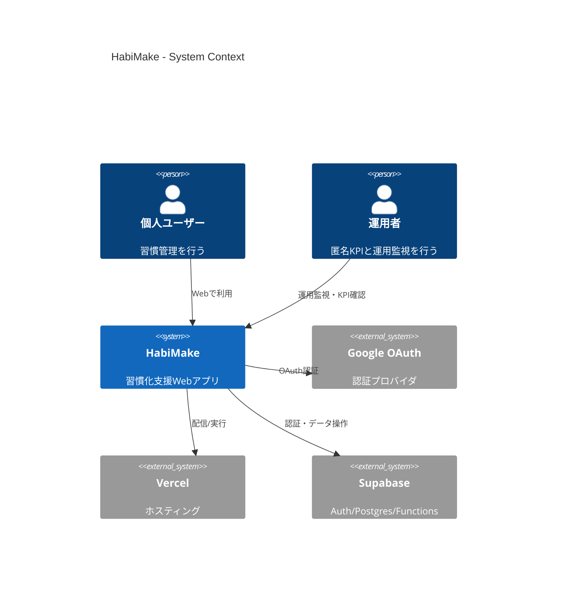
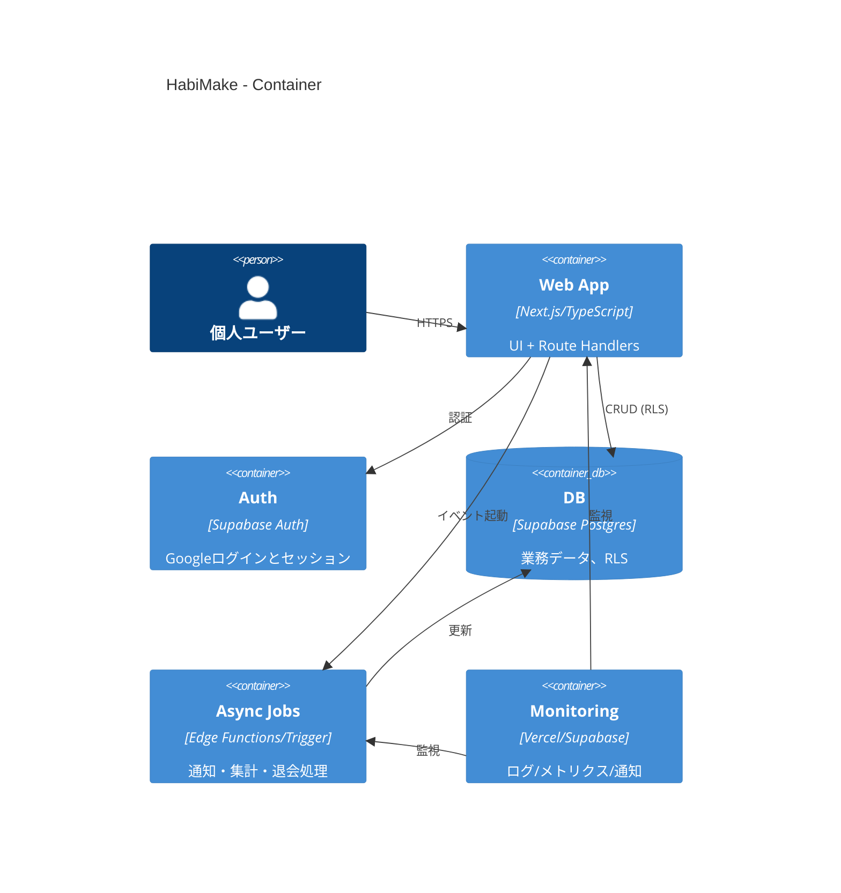
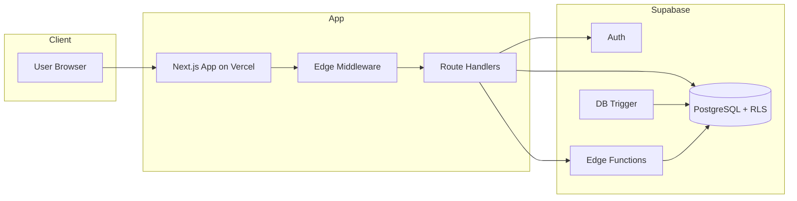
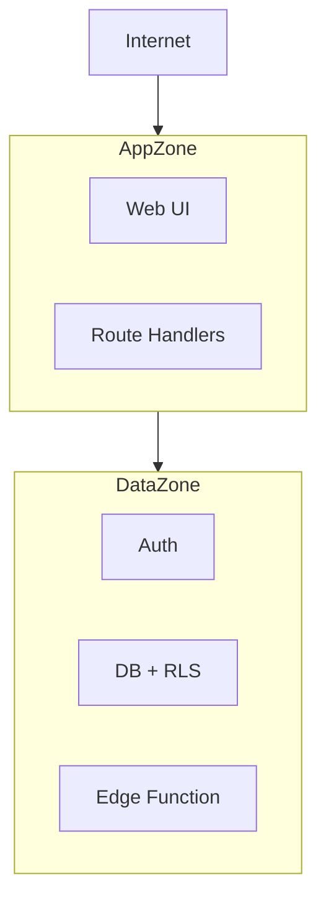

# アーキテクチャ設計書

## 0. ドキュメント情報
| 項目 | 内容 |
| -- | -- |
| システム名 | HabiMake |
| 対象スコープ | MVP（認証/同意、習慣管理、チェックイン、可視化、設定、退会、匿名KPI） |
| バージョン | v0.3-draft |
| 作成日 | 2026-02-11 |
| 作成者 | Codex |
| 承認者 | aliyell |
| 更新方針 | 要件ID/FR-ID/NFR-ID/CON-IDに影響する変更時に同時更新 |

## 1. アーキテクチャ概要
### 1.1 目的・前提
- 目的：`docs/01_Project_Design/01_Requirements.md` と `docs/01_Project_Design/02_Business_Process.md` の要件を、実装可能な構成へ落とし込む。
- ゲート0合意（2026-02-11）：
  - 優先順位：開発スピード > コスト最小 > 将来スケール
  - チームスキル：保守的に低経験前提で設計
  - 言語方針：全面TypeScript
  - 1年後規模：MAU 100-500
  - SLO公開：外部明文化しない（内部SLOのみ）
  - 退会削除：60秒以内は利用不可化、完全削除5分以内
  - 運用KPI閲覧：MVPは運用画面を作らずCLI/SQL運用
  - 監視：Vercel/Supabase標準 + メール通知（P1中心）、APMはTBD
  - CI/CD：GitHub Actions + Supabase CLI + Vercel連携
  - コスト方針：非商用用途の範囲で `Vercel Hobby + Supabase Free` を採用し、Renderは不採用
  - 法令準拠範囲：MVPはAPPIのみ（越境データ移転なし）
  - 外部監査/認証：MVPではISO 27001/SOC 2は取得しない
- 前提（ASSUMPTION）：
  - ASSUMPTION-ARCH-001：MVPは `Vercel + Supabase` を採用し、追加クラウドは導入しない。
  - ASSUMPTION-ARCH-002：本番リージョンは運用開始前までに確定（TBD、期限: 2026-02-20）。
  - ASSUMPTION-ARCH-003：APM/分散トレーシングはMVPでは未導入とし、必要時に追加する。
  - ASSUMPTION-ARCH-004：MVPは非商用用途として運用し、商用化時はプラン見直しを実施する。
  - ASSUMPTION-ARCH-005：MVPで過去インシデント起因の対策追加は不要（新規プロダクトのため履歴なし）。

### 1.2 アーキテクチャスタイル（採用方針/理由/将来展望）
| 項目 | 内容 | トレース |
| -- | -- | -- |
| 採用方針 | BaaS活用のモジュラモノリス（Next.js + Supabase） | BREQ-001..006, CON-003 |
| 理由1 | 期限優先（2026-04-01）に対し実装面積を最小化 | CON-003 |
| 理由2 | 低経験前提で運用複雑性を抑制 | NFR-003, NFR-007 |
| 理由3 | RLSを中核とした認可をDBで強制しやすい | CON-001, FR-025 |
| 将来展望 | MAU>500や通知/課金導入時に、Edge Functions/別サービスへ段階分離 | BREQ-006, NFR-002 |

### 1.3 要件トレーサビリティ（NFR -> 設計要素）
| 要件ID | 要件 | 設計要素 | 検証/観測 |
| -- | -- | -- | -- |
| NFR-001 | P95 <= 3.0秒 | SSR/ISR最適化、クエリ最小化、インデックス設計 | AC-027 |
| NFR-002 | 同時10ユーザー成功率100% | API冪等化、DB一意制約、接続制御 | AC-028 |
| NFR-003 | 稼働率99.5% | マネージド基盤活用、ヘルス監視、運用Runbook | AC-029 |
| NFR-004 | 重大/高脆弱性0、RLS違反0 | RLS強制、入力検証、セキュリティ試験 | AC-030 |
| NFR-005 | 退会削除SLA | 二段階削除（60秒以内不可化 + 5分以内完全削除） | AC-023 |
| NFR-006 | RPO/RTO 24h | 日次バックアップ、復旧手順明文化 | AC-031 |
| NFR-007 | ログ保持（30/90日） | ログ分類と保持設定 | AC-032 |
| NFR-008 | 通知疎通確認 | 週1回（受入中は日次）テスト通知 | AC-033 |
| NFR-009 | APPI報告/本人通知期限 | インシデントRunbookへ法定期限を明記し訓練で検証 | AC-034 |

### 1.4 アーキテクチャ決定記録（ADR）
#### ADR-001: BaaS中心のモジュラモノリス採用
- Status: Accepted
- Context: 開発スピード優先、低経験前提、MVPスコープ限定
- Decision: Next.js + Supabase + Vercelで単一プロダクトを構成
- Consequences:
  - Positive: 実装/運用を単純化し、短納期に適合
  - Negative: ベンダ依存度が上がる（将来分離方針が必要）
- Trace: CON-003, NFR-003

#### ADR-002: 認可はRLS中心で強制
- Status: Accepted
- Context: 本人以外アクセス拒否を確実化する必要
- Decision: `profiles/habits/habit_logs` をRLSで制御し、`auth.uid() = user_id` を基本条件にする
- Consequences:
  - Positive: アプリ層バグ時もDB層で防御
  - Negative: SQLポリシーと試験整備が必須
- Trace: CON-001, FR-025, NFR-004

#### ADR-003: 退会削除を二段階化（MVP）
- Status: Accepted
- Context: 60秒以内の完全削除を同期で保証すると失敗率増の懸念
- Decision:
  - 60秒以内：ログイン不可 + 個人データ参照不可（ユーザー体感の即時性）
  - 5分以内：完全削除完了
- Consequences:
  - Positive: 可用性と削除保証の両立
  - Negative: 削除完了監視の実装・運用が必要
- Trace: FR-023, NFR-005, CON-002

#### ADR-004: KPI集計をハイブリッド方式
- Status: Accepted
- Context: イベント別に最適な実装位置が異なる
- Decision:
  - Edge Functions優先：ログイン/同意/退会など制御系
  - Trigger適用：チェックインなどDBイベント加算
- Consequences:
  - Positive: 実装単純化と一貫性の両立
  - Negative: 実行場所が複数になるため監査設計が必要
- Trace: FR-018, BREQ-006

#### ADR-005: 最小コスト構成（Hobby/Free、Render不採用）
- Status: Accepted
- Context: 個人開発でランニングコストを最小化したい
- Decision:
  - `Vercel Hobby`（非商用用途）
  - `Supabase Free`
  - `Render` は採用しない
- Consequences:
  - Positive: 固定費を最小化できる
  - Negative: プラン上限超過時は性能/運用制約が出るため、商用化または利用増加時に有償化判断が必要
- Trace: CON-003, NFR-003

## 2. 技術スタック
### 2.1 クライアントサイド（言語/フレームワーク/バージョン/選定理由/更新方針）
| 区分 | 採用技術 | バージョン方針 | 選定理由 | トレース |
| -- | -- | -- | -- | -- |
| 言語 | TypeScript | LTS安定版追従 | 全面TS方針で保守性確保 | ゲート0-3 |
| Web | Next.js (React) | 安定版（メジャー固定） | 開発速度とVercel連携 | BREQ-001, CON-003 |
| UI | Tailwind CSS（想定） | マイナー追従 | 画面実装速度を優先 | CON-003 |
| 認証SDK | Supabase JS | 安定版 | Auth/DB連携の一本化 | FR-001, FR-025 |

### 2.2 サーバーサイド
| 区分 | 採用技術 | 役割 | 選定理由 | トレース |
| -- | -- | -- | -- | -- |
| 実行基盤 | Next.js Route Handlers / Server Actions | API/業務処理 | プロジェクト分割を最小化 | CON-003 |
| BaaS | Supabase Auth + Postgres | 認証/データ永続化 | 低運用負荷でMVP適合 | FR-001..026 |
| 非同期 | Supabase Edge Functions | 制御系イベント処理 | 退会・同意・通知起点に適合 | FR-018, FR-023 |

### 2.3 データベース・ストレージ
| 区分 | 採用技術 | 用途 | トレース |
| -- | -- | -- | -- |
| RDBMS | Supabase PostgreSQL | `profiles/habits/habit_logs/user_daily_activity/policy_consents/analytics_daily_kpi` | FR-005, FR-011, FR-023 |
| 制約 | UNIQUE/INDEX/RLS | 冪等・性能・認可担保 | FR-012, FR-025, NFR-001 |
| オブジェクト保管 | 利用しない（MVP） | ファイル要件なし | スコープ外 |

### 2.4 インフラ・環境
| 区分 | 採用技術 | 役割 | トレース |
| -- | -- | -- | -- |
| ホスティング | Vercel Hobby（非商用） | Web配信/デプロイ | CON-003 |
| 認証 | Google OAuth (via Supabase) | ログイン | FR-001 |
| BaaS | Supabase Free | Auth/DB/Functions | FR-001..026 |
| CI/CD | GitHub Actions + Vercel + Supabase CLI | 自動テスト/デプロイ | ゲート0-10 |
| 監視 | Vercel/Supabase標準 + メール通知 | P1/P2通知 | FR-018, NFR-008 |
| 運用操作 | Supabase SQL Editor / CLI | 匿名KPI確認・監査ログ抽出 | BRL-011, FR-018 |
| 補助PaaS | Render（不採用） | 不使用（必要時のみ再評価） | ADR-005 |

## 3. システム構成図
### 3.1 C4 Model - Level 1 (Context)


### 3.2 C4 Model - Level 2 (Container)


### 3.3 ソフトウェア構成図


### 3.4 データフロー/信頼境界

- 主要機密経路：認証トークン、個人データ、同意履歴
- 保護方針：TLS、RLS、秘密鍵のサーバ側限定配置

## 4. API Gateway 構成
- 採用：専用API Gatewayは置かず、`Vercel Edge Middleware` を論理ゲートウェイとして運用
- 役割：
  - 認証前後ルーティング（`/policy` への強制導線）
  - レート制御（簡易、詳細はTBD）
  - 共通ヘッダ付与（セキュリティヘッダ）
- 将来拡張（TBD, 2026-Q3目安またはBot兆候検知時）：
  - WAF/専用Gateway導入（Bot対策・詳細スロットリング）
- トレース：FR-002, FR-003, NFR-004

## 5. Documentation as Code
- 管理場所：`docs/01_Project_Design/*.md`
- 図形式：Mermaid（レビュー可能なテキスト管理）
- 更新ルール：
  - PRで要件ID変更がある場合、関連設計書更新を必須化
  - ADR更新時は `Status/Date/Trace` を必須記載
- CI品質ゲート（文書）：
  - Markdown lint（TBD）
  - Mermaid構文チェック（TBD）

## 6. 非機能要件の実装方式
### 6.1 可用性設計（目標値/実装方式/障害分離）
| 項目 | 目標値 | 実装方式 | トレース |
| -- | -- | -- | -- |
| 稼働率 | 99.5%/月（内部SLO） | マネージド基盤 + 障害時手順 | NFR-003 |
| 障害検知 | P1即時通知 | Vercel/Supabase標準監視 + メール | FR-018, NFR-008 |
| 障害分離 | 認証/DB障害の切り分け | 監視ダッシュボードを分離管理 | NFR-003 |

### 6.2 性能・拡張性設計（目標値/負荷モデル/実装方式）
| 項目 | 目標値 | 実装方式 | トレース |
| -- | -- | -- | -- |
| 画面応答 | P95 <= 3.0秒 | DBインデックス、取得列最小化 | NFR-001 |
| 並行性 | 同時10ユーザー成功率100% | 冪等処理+一意制約+軽量API | NFR-002, FR-012 |
| 想定規模 | MAU 100-500 | モジュール分割と関数分離で拡張 | ゲート0-4 |

### 6.3 セキュリティ設計（ネットワーク/認証認可/データ保護/脅威分析）
- ネットワーク：HTTPS/TLS、秘密鍵はサーバ側のみ
- 認証：Google OAuth + Supabase Session
- 認可：RLS強制、運用者は匿名KPIのみ
- データ保護：ログ最小化、個人識別子の出力抑制
- コンプライアンス：MVPはAPPI準拠のみ、GDPR/CCPAは海外展開時に再評価

| 脅威 | 対象 | 対策 | トレース |
| -- | -- | -- | -- |
| Spoofing | 認証 | OAuth/OIDCフロー準拠 | FR-001 |
| Tampering | API入力 | バリデーション + RLS | FR-021, FR-025 |
| Repudiation | 重要操作 | 監査ログ必須項目記録 | FR-026, NFR-007 |
| Information Disclosure | 個人データ | RLS/最小権限 | CON-001 |
| DoS | API | レート制御（簡易） | NFR-001, NFR-003 |

### 6.4 ログ・監視設計（フォーマット/レベル/監視項目/トレーシング）
| 項目 | 方針 | トレース |
| -- | -- | -- |
| フォーマット | JSON構造化ログ | NFR-007 |
| レベル | INFO/WARN/ERROR | NFR-007 |
| 監視項目 | 5xx率、Auth失敗率、P95遅延、削除ジョブ失敗 | FR-018, NFR-008 |
| トレーシング | MVPは未導入（TBD） | ASSUMPTION-ARCH-003 |

### 6.5 バックアップ・リカバリ設計
| 項目 | 方針 | トレース |
| -- | -- | -- |
| バックアップ | 日次、保持7日 | NFR-006 |
| RPO/RTO | 24h / 24h | NFR-006 |
| 退会時整合 | 本番DBは60秒以内に不可化、完全削除は5分以内目標 | FR-023, CON-002 |

### 6.6 SLO/エラーバジェット
- 内部SLO：
  - 可用性：99.5%/月
  - 主要画面P95：3.0秒以下
- エラーバジェット（可用性）：
  - 月間許容停止：約3時間36分
- 運用ルール：
  - バジェット超過時は機能追加より安定化を優先

## 7. 運用設計
### 7.1 運用責任分界（RACI）
| 項目 | Responsible | Accountable | Consulted | Informed |
| -- | -- | -- | -- | -- |
| 障害一次対応 | aliyell | aliyell | - | 必要関係者 |
| リリース判定 | aliyell | aliyell | - | 必要関係者 |
| 要件変更 | aliyell | aliyell | - | 必要関係者 |

### 7.2 インシデント対応
1. 監視通知受信（P1/P2）
2. 影響範囲判定（認証/DB/アプリ）
3. 暫定復旧（再デプロイ、設定戻し）
4. APPI法定対応（速報5日以内、確報30日以内/不正アクセス等60日以内、本人通知は速やかかつ原則速報と同時）
5. 恒久対応チケット化とポストモーテム（再発防止）

## 8. 開発・運用環境
### 8.1 環境区分（Dev/Stg/Prod）
| 環境 | 用途 | データ方針 |
| -- | -- | -- |
| Dev | 日次開発 | ダミーデータのみ |
| Stg | 受入試験 | 本番相当設定、匿名化データ |
| Prod | 本番運用 | 実データ |

### 8.2 運用ルール
- Preview環境から本番DBへ接続しない
- 環境変数はGitHub/Vercel/Supabaseの秘密管理機能で管理
- `service_role` はサーバ実行コンテキスト限定

## 9. CI/CDパイプライン（ツール/フロー/品質ゲート）
| フェーズ | ツール | 品質ゲート |
| -- | -- | -- |
| PR | GitHub Actions | lint/typecheck/test |
| DB変更 | Supabase CLI | migration diff/適用検証 |
| デプロイ | Vercel | build成功 + スモークテスト |
| リリース後 | 運用監視 | P1/P2アラート監視 |

## 10. エラーハンドリング方針
### 10.1 エラー分類と対応
| 区分 | 例 | 応答 | ログ |
| -- | -- | -- | -- |
| 入力エラー | 不正TZ/時刻 | 400系 + 入力修正案内 | WARN |
| 権限エラー | 他ユーザーデータ参照 | 403 | WARN + 監査 |
| 業務エラー | archived習慣チェックイン | 409相当 | INFO |
| システムエラー | DB/Auth障害 | 500 | ERROR + 通知 |

### 10.2 エラーレスポンス形式
```json
{
  "code": "FORBIDDEN",
  "message": "アクセス権限がありません",
  "trace_id": "uuid",
  "requirement_id": "FR-025"
}
```

## 11. インフラコスト見積もり
| 項目 | 月額目安 | 備考 |
| -- | -- | -- |
| Vercel Hobby | USD 0 | 非商用用途前提、上限超過時はPro検討 |
| Supabase Free | USD 0 | 無料枠前提、上限超過時はPro検討 |
| 通知/メール | USD 0-10 | MVPは低コスト想定 |
| Render | USD 0 | 不採用 |
| 合計 | USD 0-10 | 目安（無料枠内運用時） |

## 12. 制約事項・前提条件
### 12.1 技術的制約
- `CON-001` RLS必須
- `CON-002` 退会時削除必須
- `CON-003` 目標リリース日準拠
- `CON-008` P2通知既定無効
- `CON-009` MVPはAPPIのみを法令準拠範囲とする
- VercelはHobby（非商用）前提で運用する
- RenderはMVPでは利用しない

### 12.2 外部依存サービス
| 依存ID | サービス | 依存内容 | 緩和策 |
| -- | -- | -- | -- |
| DEP-001 | Google OAuth | 認証可用性 | 設定事前検証 |
| DEP-002 | Vercel/Supabase | 監視通知 | テスト通知で疎通確認 |
| DEP-003 | Supabase | `policy_settings`管理 | 更新手順の運用定義 |

### 12.3 データ保持期限
| 対象 | 保持期限 | トレース |
| -- | -- | -- |
| アプリログ | 30日 | NFR-007 |
| 監査ログ | 90日 | NFR-007 |
| バックアップ | 7日 | NFR-006 |
| 匿名KPI | 保持（ポリシー準拠） | BREQ-006 |

## 改訂履歴
| 版 | 日付 | 変更概要 | 作成者 | 承認 |
| -- | -- | -- | -- | -- |
| v0.1-draft | 2026-02-11 | 初版作成（ゲート0反映） | Codex | aliyell |
| v0.2-draft | 2026-02-11 | 非商用最小コスト構成を反映（Vercel Hobby + Supabase Free、Render不採用） | Codex | aliyell |
| v0.3-draft | 2026-02-11 | APPI運用方針（法定報告期限、WAF判断条件、MVP監査方針）を反映 | Codex | aliyell |
