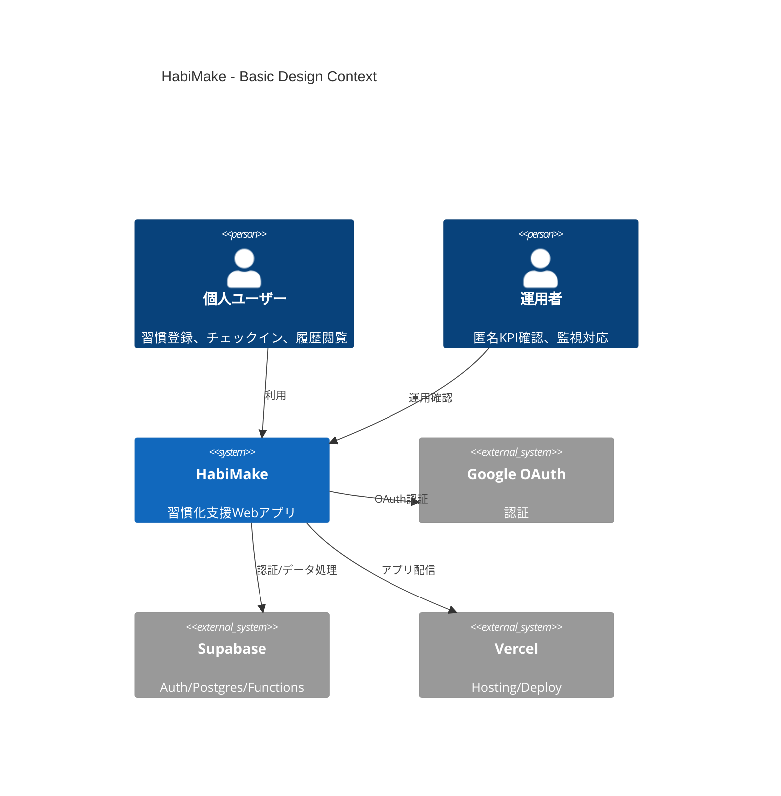
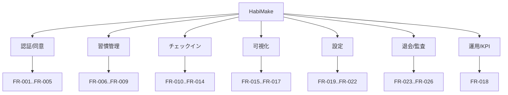

# 基本設計書

## 1. はじめに
### 1.1 ドキュメントの目的
- 本書は、要件定義（What）を実装可能な機能構成・非機能方針・外部インターフェース方針へ落とし込むことを目的とする。
- 詳細設計（画面項目定義、API項目定義、物理DDL）は本書の対象外とする。

### 1.2 対象読者
- プロダクトオーナー
- 開発担当（設計/実装）
- 運用担当

### 1.3 関連ドキュメント
- `docs/01_Project_Design/01_Requirements.md`
- `docs/01_Project_Design/02_Business_Process.md`
- `docs/01_Project_Design/03_Architecture.md`

## 2. システム概要 (C4 Model - Level 1: System Context)
### 2.1 システムの背景と目的
- 背景：記録負荷・達成可視化不足・再開困難が継続率低下の主要因。
- 目的：個人ユーザーの継続行動を、日次チェックインとストリーク可視化で支援する。
- ビジネス目標：
  - Retention_7d 30%
  - Retention_30d 10%
  - 週平均チェックイン 6回/週
  - 習慣登録→初回達成率 60%
- トレース：BREQ-001..006

### 2.2 システムコンテキスト図（Mermaid）

### 2.3 システムの範囲（スコープ）- In/Out Scope
| 区分 | 内容 | トレース |
| -- | -- | -- |
| In Scope | Googleログイン、同意管理、習慣管理、チェックイン、履歴/ストリーク、設定変更、退会、匿名KPI | BREQ-001..006 |
| Out Scope | ユーザー通知、課金、コミュニティ | 01_Requirements 3.3 |
| チャネル | Web（スマホ中心） | BP 1.2 |

## 3. アーキテクチャ上の決定事項 (ADR)
| ID | タイトル | ステータス | 決定事項 | コンテキスト・理由 |
| -- | -- | -- | -- | -- |
| ADR-001 | モジュラモノリス採用 | Accepted | Next.js + Supabase + Vercelを採用 | MVP期限と低経験前提で開発速度を優先 |
| ADR-002 | RLS中心認可 | Accepted | DBレイヤで本人データのみ許可 | CON-001/RLS違反0の実現 |
| ADR-003 | 退会削除二段階化 | Accepted | 60秒以内不可化 + 5分以内完全削除 | 実運用の安定性確保 |
| ADR-004 | KPI集計ハイブリッド | Accepted | Edge Functions優先 + Trigger併用 | 制御系/加算系で最適実装が異なる |
| ADR-005 | 最小コスト構成 | Accepted | Vercel Hobby + Supabase Free、Render不採用 | 個人開発で固定費最小化 |

## 4. 機能要件概要
### 4.1 機能構成図（Mermaid）

### 4.2 主要機能一覧（ID/機能名/概要/備考）
| ID | 機能名 | 概要 | 備考 |
| -- | -- | -- | -- |
| FNC-001 | 認証・同意制御 | Googleログイン後にterms/privacy同意状態を判定し、未完了時は同意画面へ遷移 | FR-001..005 |
| FNC-002 | 習慣管理 | 習慣の作成/更新/アーカイブ/再開を提供 | FR-006..009 |
| FNC-003 | 業務日付判定 | TZ + 締め時刻から`log_date`を算出 | FR-010 |
| FNC-004 | チェックイン管理 | 当日達成登録、重複冪等、archived拒否、当日取消を提供 | FR-011..014 |
| FNC-005 | 可視化 | ストリーク計算、履歴表示（archived既定非表示） | FR-015..017 |
| FNC-006 | 設定管理 | TZ/締め時刻変更、入力検証、監査記録 | FR-019..022 |
| FNC-007 | 退会処理 | 退会確定後の不可化・削除完了処理 | FR-023..024 |
| FNC-008 | 認可/監査 | RLSによるアクセス制御と監査必須項目記録 | FR-025..026 |
| FNC-009 | 運用通知/KPI | 監視閾値通知と匿名KPI観測 | FR-018 |

## 5. 非機能要件概要
### 5.1 可用性・信頼性
- 内部SLO：99.5%/月（外部公開SLAは設定しない）
- 監視対象：5xx率、Auth失敗率、P95遅延、削除ジョブ失敗
- バックアップ：日次、保持7日、RPO/RTO 24h
- トレース：NFR-003, NFR-006, NFR-008

### 5.2 性能・拡張性
- 主要画面P95：3.0秒以下
- 同時10ユーザーの主要操作成功率100%
- インデックス・クエリ最適化、一意制約で冪等担保
- 将来拡張：通知/課金導入時に機能分離（TBD）
- トレース：NFR-001, NFR-002, FR-012

### 5.3 セキュリティ
- 認証：Google OAuth（Supabase Auth）
- 認可：RLS（本人データのみ）
- データ保護：個人情報ログ出力の抑制
- 監査：`user_id/日時/アクション/対象ID/結果` を必須
- コンプライアンス：MVPはAPPI準拠のみ（GDPR/CCPAは海外展開時に再評価）
- トレース：CON-001, CON-002, CON-009, NFR-004, NFR-009, FR-026

## 6. 外部インターフェース概要
| IF-ID | 連携先システム | 連携方式 | データフロー | 備考 |
| -- | -- | -- | -- | -- |
| IF-001 | Supabase Auth + Google OAuth | SDK/HTTPS | ログイン、セッション管理 | FR-001 |
| IF-002 | Supabase Postgres API | SDK/HTTPS + SQL | 習慣/ログ/設定/同意のCRUD | FR-005, FR-006..FR-022 |
| IF-003 | 監視通知（メール） | 基盤標準通知 | 閾値超過時に運用通知 | FR-018 |
| IF-004 | `policy_settings` 更新IF（内部） | service role経由 | 規約版数更新と監査 | BRL-006, FR-026 |
| IF-005 | 運用CLI/SQL（内部） | Supabase SQL Editor / CLI | 匿名KPI確認、監査ログ抽出、退会削除追跡 | FR-018, FR-023, FR-026 |

## 7. 運用・保守の基本方針
- 監視運用：
  - P1：即時通知（ログイン不能、5xx重大増加、DB接続不可）
  - P2：既定無効、必要時のみ有効化
- 障害対応：
  - 初動：影響判定と暫定復旧
  - 法定対応（APPI）：速報5日以内、確報30日以内（不正アクセス等は60日以内）、本人通知は速やか（原則速報と同時）
  - 復旧後：再発防止をDecision Logへ反映
- 保守：
  - 依存ライブラリ更新（月次）
  - 依存脆弱性スキャン（Dependabot等、週次）
  - RLS/監査設定差分確認（月次）
  - 匿名KPI/監査ログの確認はCLI/SQL手順で実施（MVPは運用画面なし）
  - 運用アクセスはMFA必須・共有アカウント禁止、IP/端末制限はMVPでは非導入（運用者2名以上で再評価）
- トレース：NFR-007, NFR-008, CON-008

## 8. 今後の拡張性・制約事項
### 拡張性
- 通知多チャネル（Slack/PagerDuty）を将来拡張としてTBD管理
- KPI可視化の専用管理画面追加（必要時）
- 頻度拡張（毎日固定以外）への対応は将来フェーズ
- WAF/専用GatewayはMVP後3〜6か月（目安: 2026-Q3）またはBot兆候検知時に導入判断

### 制約事項
- 制約：
  - RLS必須
  - 退会時削除必須
  - 目標リリース日固定
  - 運用KPIの閲覧/抽出はMVPではCLI/SQL運用（管理画面は将来拡張）
  - MVPの法令準拠範囲はAPPIのみ（越境データ移転なし前提）
  - 非商用用途でVercel Hobbyを利用し、商用化時にプラン見直しを行う
  - SupabaseはFreeプラン前提で開始し、上限超過時に有償化を判断する
  - RenderはMVP構成に含めない
  - 外部監査/認証（ISO 27001/SOC 2）はMVPでは取得しない（商用化/B2B時に再評価）
- オープン課題（要件追補）：
  - ISSUE-BD-002：本番リージョンの最終確定（期限 2026-02-20）
