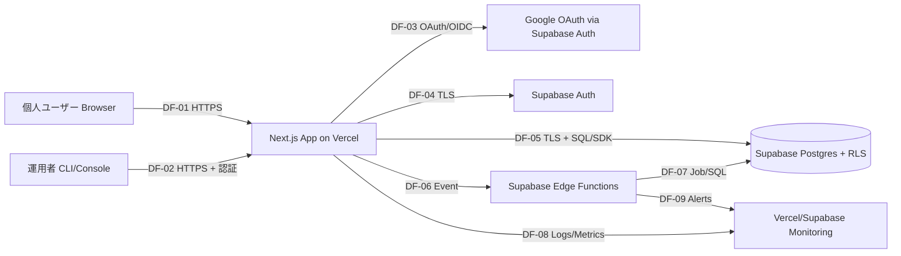

# セキュリティ設計書

## 1. セキュリティ基本方針

### 1.0 文書情報

| 項目 | 内容 |
| --- | --- |
| システム名 | HabiMake |
| 対象 | MVP（認証/同意、習慣管理、チェックイン、可視化、設定、退会、匿名KPI） |
| 作成日 | 2026-02-11 |
| 作成者 | Codex |
| 参照 | `docs/01_Project_Design/01_Requirements.md`, `docs/01_Project_Design/02_Business_Process.md`, `docs/01_Project_Design/03_Architecture.md`, `docs/01_Project_Design/04_Basic_Design.md` |

### 1.1 目的と適用範囲

- 目的：`NFR-004`（重大/高脆弱性0、RLS違反0）、`NFR-005`（退会削除SLA）、`NFR-007`（監査ログ保持）を満たす実装方針を定義する。
- 適用範囲：Webアプリ（Vercel）、認証/DB/非同期処理（Supabase Auth/Postgres/Edge Functions）、外部認証（Google OAuth）。
- セキュリティ原則：Defense in Depth、最小権限、Fail Secure、監査可能性、ゼロトラスト前提。

### 1.2 準拠基準（採用方針）

| 基準 | 採用レベル/方針 | 本PJへの適用 |
| --- | --- | --- |
| OWASP ASVS | Level 2（MVPの目標基準） | 認証/認可、セッション、入力検証、ログ監査、設定管理 |
| OWASP Top 10 | 2021版を最低対策基準 | A01〜A10の予防/検知/対応策を設計へ反映 |
| NIST CSF | Identify/Protect/Detect/Respond/Recoverで統制 | 脅威分析、保護策、監視、IR、復旧 |
| CIS Controls | v8のIG1中心 | 脆弱性管理、ログ管理、アクセス管理 |
| ISO/IEC 27001 | Annex Aの統制観点を参照 | アクセス制御、暗号、運用、インシデント管理 |

### 1.3 セキュリティ要件トレーサビリティ（抜粋）

| 要件ID | 要件 | セキュリティ設計方針 |
| --- | --- | --- |
| CON-001 / FR-025 | 本人以外アクセス禁止（RLS必須） | DB層でDeny by Default、`auth.uid() = user_id`のスコープ強制（SC-001/002） |
| CON-002 / FR-023 / NFR-005 | 退会時60秒以内不可化、5分以内削除 | 二段階削除（即時不可化 + 非同期完全削除）と削除監査ログ |
| CON-004 / FR-005 | 同意履歴保持と再同意必須 | `policy_consents`版管理 + `policy_settings`変更監査 |
| CON-009 / NFR-009 | MVPの法令準拠範囲（APPI）と報告期限 | APPI期限に合わせたインシデント報告・本人通知フローを運用手順化 |
| FR-026 / NFR-007 | 監査ログ必須項目と保持期間 | 操作監査の標準スキーマ化、30日/90日保持 |
| NFR-004 / AC-030 | 重大/高脆弱性0、RLS違反0 | セキュア実装 + 脆弱性診断 + RLS試験をリリースゲート化 |

### 1.4 データ分類

| 分類 | 定義 | 対象データ | 最低統制 |
| --- | --- | --- | --- |
| DCL-1 公開 | 公開しても影響軽微 | 公開説明文、ヘルプ文面 | 改ざん防止（リリース管理） |
| DCL-2 内部 | 社内運用向け、個人識別子なし | 匿名KPI（SC-003）、運用設定値 | アクセス制限、監査 |
| DCL-3 機密（個人データ） | 漏えい時にプライバシー影響 | `profiles`, `habits`, `habit_logs`, `policy_consents`, `user_daily_activity` | RLS必須、暗号化通信、監査 |
| DCL-4 高機密（認証/特権） | 漏えい時に直接侵害へ接続 | セッション情報、`auth.users`関連、`service_role`キー | サーバ限定保管、ローテーション、アクセス記録 |

### 1.5 コンプライアンス前提（確定: 2026-02-11）

- 準拠規制は APPI（個人情報保護法）のみを対象とする。
- 想定ユーザーは国内個人ユーザーであり、MVP時点では越境データ移転なし。
- GDPR/CCPAは現時点では対象外とし、海外展開または海外ユーザーを明示対象にする段階で再評価する。
- APPI統制として、利用目的の明示、同意証跡管理、退会時削除、法定報告期限運用を実装済み要件として扱う（CON-002, CON-004, CON-009, NFR-009）。
- 外部監査/認証（ISO 27001/SOC 2）はMVPでは取得しない。商用化かつB2B展開時に再検討する。

### 確認ゲート0（合意結果）

1. 準拠規制：`APPIのみ`（GDPR/CCPAはMVP対象外）。
2. 外部監査/認証：MVPでは取得予定なし。
3. データ分類：現行 `DCL-1..4` を採用し、追加分類なし。

## 2. 脅威モデリング (Threat Modeling)

### 2.1 システム境界とDFD

### 2.2 信頼境界（Trust Boundary）

- TB-1：インターネット境界（Browser/運用端末 ↔ Vercel App）。
- TB-2：アプリ境界（Vercel App ↔ Supabase Auth/DB/Functions）。
- TB-3：運用境界（運用者CLI/SQL ↔ Supabase、`service_role`利用）。

### 2.3 STRIDE分析と対策

| ID | 対象フロー | STRIDE | 脅威 | リスク | 主対策 | トレース |
| --- | --- | --- | --- | --- | --- | --- |
| TH-001 | DF-01/03 | S | OAuthセッションなりすまし | 高 | OIDC準拠、state/nonce検証、HTTPS強制 | FR-001, NFR-004 |
| TH-002 | DF-05 | T | API/DB入力改ざん | 高 | サーバ側バリデーション、RLS、一意制約 | FR-021, FR-025, FR-012 |
| TH-003 | DF-05/07 | R | 操作否認（設定変更/退会） | 高 | 監査必須項目 + `policy_settings`差分監査 | FR-026, BRL-013 |
| TH-004 | DF-05/08 | I | 個人データ漏えい（誤参照/誤ログ） | 高 | RLS、最小権限、機密値ログ抑止、匿名KPI限定 | CON-001, SC-001..004 |
| TH-005 | DF-01/05 | D | ログイン/チェックインAPIへの過負荷 | 中 | Edge Middlewareでレート制御、監視閾値通知 | FR-018, NFR-003 |
| TH-006 | DF-02/07 | E | `service_role`濫用による権限昇格 | 高 | サーバ実行限定、鍵ローテーション、操作監査 | DEP-003, FR-026 |
| TH-007 | DF-07 | T/I | 退会削除ジョブ失敗による残存 | 高 | 二段階削除、失敗時再実行、削除完了追跡 | FR-023, NFR-005 |
| TH-008 | DF-02/05 | T/E | 運用者操作ミス（誤SQL） | 中 | 変更手順化、レビュー、監査ログ、最小権限 | BRL-011, BRL-013 |

### 2.4 リスク評価基準

- 影響度：高（法令/個人情報/サービス継続に重大影響）、中、低。
- 発生可能性：高（容易に再現可能）、中、低。
- リスク判定：`高 = 影響高 or 影響中×可能性高`、`中 = それ以外`。
- 優先順位：高リスク（TH-001/002/003/004/006/007）をリリース前必須対策とする。

### 2.5 保護対象資産（優先）

1. 個人データ（DCL-3）：習慣・履歴・同意履歴。
2. 認証/特権情報（DCL-4）：セッション、`service_role`、`auth.users`。
3. 監査証跡：退会、同意、権限エラー、設定変更の監査ログ。

### 確認ゲート1（合意結果）

1. 攻撃者モデル：`外部攻撃者 + 認証済み悪意ユーザー + 誤操作する内部運用者` を採用。
2. 高リスク脅威（TH-001/002/003/004/006/007）を優先実装対象として確定。
3. 過去インシデント：新規プロダクトのため該当なし。机上訓練で主要シナリオをカバーする。

## 3. 認証・認可設計

### 3.1 認証方式

- 採用方式：Google OAuth（Supabase Auth経由）。
- ローカルID/Password：MVPでは非採用（パスワード保管を持たない設計）。
- 同意ゲート：認証後に `terms/privacy` 最新版同意を必須判定（FR-002〜005）。
- セッション方針：短命アクセストークン + リフレッシュ前提、未同意/退会時は即時セッション破棄。

### 3.2 MFA方針

- 一般ユーザー：Google側MFA設定に依存（アプリ内MFAはMVP対象外）。
- 運用者/特権操作：GoogleアカウントMFA有効化を必須運用とする。

### 3.3 認可モデル

- モデル：RBAC（ROLE-001/002） + データスコープ制御（SC-001..004） + RLS強制。
- 基本方針：Deny by Default、本人所有データのみ許可。
- スコープ適用：
  - SC-001：本人データ限定。
  - SC-002：`active`習慣のみチェックイン可。
  - SC-003：匿名KPIのみ運用者参照可。
  - SC-004：`user_daily_activity`はサーバ内部参照のみ。

### 3.4 API認可・特権アクセス

- クライアントには `service_role` を配布しない。
- `policy_settings` 更新は service role 経由のみ（DEP-003）。
- 特権操作（`policy_settings`更新、退会削除再実行）は監査ログを必須化。

### 3.5 認証・認可トレーサビリティ

| 項目 | 設計 | 要件トレース |
| --- | --- | --- |
| 認証 | Google OAuth + Supabase Session | FR-001 |
| 同意制御 | 最新版同意チェックと同意履歴一意性 | FR-002〜005, CON-004, CON-006 |
| データ認可 | RLSで本人スコープ制御 | FR-025, CON-001 |
| 特権監査 | `policy_settings`更新差分監査 | FR-026, BRL-013 |

### 確認ゲート2（合意結果）

1. 認証方式：`Google OAuth単一` で確定。
2. 運用者特権操作：MFA必須 + 共有アカウント禁止で確定。
3. データ参照方針：MVPでは `SC-003`（匿名KPI）を超える運用者参照を許可しない。

## 4. データ保護設計

### 4.1 通信暗号化

- 外部通信：TLS 1.2+ を必須（HTTPはHTTPSへリダイレクト）。
- 内部通信：Vercel-Supabase間もTLS前提。
- 推奨ヘッダ：HSTS（長期）、`Secure`/`HttpOnly`/`SameSite`属性。

### 4.2 保存データ保護

- DB/ストレージ暗号化：基盤提供の暗号化を利用（Supabase管理）。
- 機密カラム運用：将来機微項目追加時はカラム単位暗号化を適用。
- バックアップ：日次/7日保持（NFR-006）、退会後バックアップ残存は最大7日前提。

### 4.3 鍵・シークレット管理

- `service_role` と外部連携秘密はVercel/Supabase/GitHubの秘密管理で保管。
- 平文でのリポジトリ保存を禁止。
- ローテーション：定期（90日目安）または漏えい疑い時に即時。

### 4.4 個人データの取扱い

- 退会時：60秒以内不可化、5分以内完全削除（`profiles/habits/habit_logs/user_daily_activity/policy_consents/auth.users`）。
- ログ：個人情報の出力を最小化し、監査必須項目は専用ログへ記録。
- 匿名化：KPIは個人識別子を除去して運用者参照（SC-003）。

### 4.5 パスワード方針

- MVPはローカルパスワードを保持しない。
- 将来導入時は Argon2id（推奨）または bcrypt（十分なコスト係数）を必須。

### 確認ゲート3（合意結果）

1. 監査ログ保持：監査90日、アプリ30日で確定（MVP規模で妥当）。
2. 退会削除：60秒不可化 + 5分完全削除をAPPI運用統制として継続。
3. 鍵運用：定期ローテーション（目安90日）を採用。

## 5. アプリケーションセキュリティ

### 5.1 OWASP Top 10 対策

| 項目 | 対策 | トレース |
| --- | --- | --- |
| A01 Broken Access Control | RLS + SC制御 + 403監査 | FR-025, BRL-009 |
| A02 Cryptographic Failures | TLS必須、秘密管理、ログ最小化 | NFR-004 |
| A03 Injection | サーバ側バリデーション、パラメタライズドクエリ | FR-021 |
| A04 Insecure Design | STRIDE、リスク優先度、確認ゲート | 本書2章 |
| A05 Security Misconfiguration | 環境分離、秘密管理、不要権限禁止 | 03_Architecture 8.2 |
| A06 Vulnerable Components | 依存脆弱性スキャン、定期更新 | NFR-004 |
| A07 Identification/Auth Failures | OAuth/OIDC準拠、同意未完了遮断 | FR-001〜004 |
| A08 Software/Data Integrity | CI/CDゲート、変更監査 | FR-026 |
| A09 Logging/Monitoring Failures | 監査必須項目・閾値通知 | NFR-007, FR-018 |
| A10 SSRF 等 | 外部通信先の固定化、サーバ側でURL制限 | 実装ガイドライン |

### 5.2 入力検証

- サーバ側バリデーションを必須（クライアント側のみ禁止）。
- ホワイトリスト方式（TZ候補、時刻形式、文字数上限）を採用。
- エラーは利用者向けメッセージと内部詳細ログを分離。

### 5.3 セキュリティヘッダ/CSP

- 必須：`Content-Security-Policy`, `X-Content-Type-Options`, `Referrer-Policy`, `X-Frame-Options`（または `frame-ancestors`）。
- 推奨：`Strict-Transport-Security`, `Permissions-Policy`。

### 5.4 エラーハンドリング

- スタックトレース/内部実装詳細は外部非公開。
- `trace_id` を応答し、監査/障害調査と突合可能にする。

### 5.5 依存関係管理

- 自動検知：Dependabot等で週次チェック。
- 重大/高脆弱性：リリースブロッカー（NFR-004, AC-030）。
- パッチ方針：重大は即時、Highは1週間以内を目安。
- 診断方針：MVPは内製（自動スキャン + 手動RLS試験）を採用し、外部ペネトレーションテストは商用化前に再評価する。

### 確認ゲート4（合意結果）

1. ASVS L2準拠をMVPの検証基準として継続する。
2. 脆弱性対応は「重大即時、High 1週間以内」を運用基準とする。
3. MVP診断は内製（Dependabot + 手動RLS試験）で実施する。

## 6. インフラ・ネットワークセキュリティ

### 6.1 境界防御とネットワーク分離

- VPCの細粒度制御はマネージド基盤制約があるため、論理分離とアクセス制御で補完。
- Edge Middlewareを論理ゲートウェイとして利用し、認証導線・レート制御・共通ヘッダを適用。
- 将来拡張：専用WAF/ゲートウェイはMVP後3〜6か月（目安: 2026-Q3）またはBot兆候検知時の早い方で導入判断する。

### 6.2 管理アクセス制御

- 運用アクセスは最小人数（現状1名）で実施。
- 運用端末・アカウントはMFA必須、共有アカウント禁止。
- 緊急時の特権操作は事後レビュー（監査ログ照合）を必須化。
- IP制限/端末制限はMVPでは導入しない。運用者が2名以上になった時点で導入を再評価する。

### 6.3 実行基盤ハードニング

- Preview環境から本番DBへの接続禁止。
- `service_role` はサーバコンテキストのみで使用。
- 不要な環境変数/権限を定期棚卸し（月次）。

### 6.4 監視連携（ネットワーク観点）

- P1：5xx異常、Auth失敗率異常、DB接続不可、削除ジョブ失敗。
- P2：P95遅延継続（既定無効、運用設定で有効化）。

### 確認ゲート5（合意結果）

1. 現構成（Vercel/Supabase）の論理境界設計を採用。
2. WAFはMVP対象外。2026-Q3またはBot兆候時に導入判断。
3. 運用アクセス統制は「MFA必須・共有禁止」を確定。IP/端末制限は運用者増加時に再評価。

## 7. 監査ログ・監視

### 7.1 監査ログ対象イベント

- 認証成功/失敗、同意実行/拒否、権限エラー、設定変更（TZ/締め時刻）、`policy_settings`更新、退会開始/不可化/削除完了/失敗。

### 7.2 監査ログ項目

| 項目 | 必須 | 説明 |
| --- | --- | --- |
| `user_id` | 必須 | 操作主体（システム操作時は`actor`併用） |
| `timestamp` | 必須 | 実行時刻（UTC基準） |
| `action` | 必須 | 操作種別 |
| `target_id` | 必須 | 対象レコード/資産 |
| `result` | 必須 | 成功/失敗 |
| `reason` | 任意 | 失敗理由（退会失敗/権限エラー等） |
| `trace_id` | 推奨 | 相関ID |

- `policy_settings`更新は `actor/changed_at/policy_type/old_version/new_version/result` を追加必須。

### 7.3 保存期間・改ざん防止

- アプリログ：30日（NFR-007）。
- 監査ログ：90日（NFR-007）。
- APPI上、保持期間の明示的法定年限はないため、MVPでは30/90日を採用する。
- 改ざん防止：基盤のアクセス制御 + 追記型運用 + 権限分離（MVP範囲）。

### 7.4 セキュリティ監視

- 検知ルール：BRL-011準拠（P1/P2閾値）。
- 通知先：単一通知先（設定可能、CON-005）。
- 到達確認：週1回（受入期間中は日次）。

### 7.5 運用KPI

- セキュリティKPI：RLS違反0、重大/高脆弱性0、退会削除SLA遵守率100%。
- 監視KPI：P1アラート一次応答時間、通知到達率。

### 確認ゲート6（合意結果）

1. 監査対象イベントは現行定義で運用開始可能。
2. ログ保持は30/90日で確定。
3. 改ざん防止はMVPでは基盤標準機能で運用する。

## 8. インシデント対応

### 8.1 対応フロー

1. 検知：監視通知（P1/P2）または問い合わせで検知。
2. 初動：15分以内に影響範囲（認証/DB/アプリ）を判定。
3. 封じ込め：必要に応じて機能制限、鍵ローテーション、アクセス遮断。
4. 根絶/復旧：原因修正、データ整合確認、再発監視。
5. 法定報告/通知（APPI）：
   - 速報：漏えい等の事態を知った日から3〜5日以内に個人情報保護委員会へ報告。
   - 確報：30日以内（不正アクセス等は60日以内）に詳細報告。
   - 本人通知：速やかに通知し、原則として速報と同時に実施する。
6. 事後対応：恒久対策と再発防止策を記録し、運用手順へ反映。

### 8.2 エスカレーション

- 一次対応：aliyell（運用責任者）。
- 二次対応：必要に応じて外部基盤サポート（Supabase/Vercel）。
- 重大時：法務・利用者通知要否を判断（規制要件に従う）。

### 8.3 主要シナリオ別対応

| シナリオ | 初動 | 恒久対策 |
| --- | --- | --- |
| 認証不正（なりすまし疑い） | セッション失効、該当アカウント保護 | OAuth設定見直し、検知ルール強化 |
| RLS逸脱/不正参照 | 該当API停止、監査ログ保全 | RLSポリシー修正、再試験 |
| 退会削除失敗 | 再実行、参照不可化維持確認 | ジョブ監視強化、再実行手順改善 |
| `service_role`漏えい疑い | 即時ローテーション、影響調査 | 秘密管理統制強化、利用経路棚卸 |

### 8.4 復旧と訓練

- 復旧目標：RPO24h/RTO24h（NFR-006）。
- 机上訓練：四半期1回（削除失敗、認証障害、権限逸脱を対象）。

## 改訂履歴

| 版 | 日付 | 変更概要 | 作成 | レビュー | 承認 |
| --- | --- | --- | --- | --- | --- |
| v0.1 | 2026-02-11 | 初版作成（脅威モデリング、認証認可、データ保護、監査・IR） | Codex | - | - |
| v0.2 | 2026-02-11 | APPI限定方針、法定報告期限、MVP運用統制（IP/端末制限非導入・内製診断・WAF時期）を確定反映 | Codex | - | - |
| v0.3 | 2026-02-11 | 要件側ID追加（CON-009/NFR-009/AC-034）とのトレーサビリティ整合を反映 | Codex | - | - |
