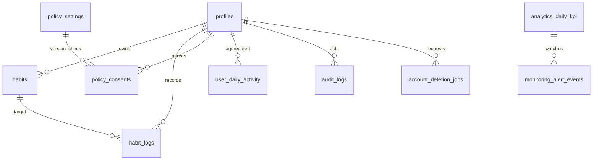

# データ設計共通

## 0. ドキュメント情報
| 項目 | 内容 |
| -- | -- |
| システム名 | HabiMake |
| 対象範囲 | 詳細設計（データ設計） |
| バージョン | v0.1 |
| 作成日 | 2026-02-11 |
| 作成者 | Codex |
| 承認者 | aliyell |
| 正本トレース起点 | `docs/01_Project_Design/05_Feature_List.md` |

## 1. 設計方針
### 1.1 基本方針
- 正規化: 3NFを基本（集計用途のみ派生テーブルを許容）。
- DBMS: Supabase PostgreSQL。
- 文字コード: UTF-8。
- タイムゾーン: DB保存はUTC、業務日付は `profiles.timezone` と `profiles.day_cutoff_time` で算出。
- トレーサビリティ: すべてのテーブルに関連 `FNC/SCR/IF/BAT` を明記する。

### 1.2 命名規約
- テーブル名: 英小文字 snake_case 複数形。
- カラム名: 英小文字 snake_case。
- PK: `id`（`profiles` は `user_id` をPK採用）。
- FK: `[参照先]_id`。
- インデックス: `idx_<table>_<cols>`。
- ユニーク制約: `uq_<table>_<cols>`。
- チェック制約: `chk_<table>_<rule>`。

### 1.3 共通カラム
| カラム名 | 型 | 必須 | 説明 |
| -- | -- | -- | -- |
| created_at | timestamptz | Yes | 作成日時（UTC） |
| updated_at | timestamptz | Yes | 更新日時（UTC） |
| deleted_at | timestamptz | No | 論理削除日時 |
| version | integer | Yes | 楽観ロック用、初期値1 |

### 1.4 削除方針
- 論理削除: `habits`（`status=archived`）を業務状態として扱う。
- 物理削除: `habit_logs`, `policy_consents`, `profiles` など退会削除対象。
- 退会要件: `FR-023` に基づき、60秒以内参照不可化・5分以内完全削除。
- 保持方針: `audit_logs` は90日、アプリログは30日、バックアップは7日（上位設計準拠）。

### 1.5 外部キーとRLS
- 方針: 業務テーブル間は厳格FKを採用。
- `auth.users` 参照: Supabase管理スキーマのため、`user_id` の整合は論理FK + 定期整合チェックで担保。
- RLS: 個人データテーブルは `auth.uid() = user_id` を基本ポリシーにする。

### 1.6 初期投入
- 初期投入データは `policy_settings` のみ。
- 初期レコード:
  - `policy_type='terms'`, `current_version='v1.0'`
  - `policy_type='privacy'`, `current_version='v1.0'`
- 実行主体: service role（`IF-004`）

## 2. 対象テーブル一覧
| テーブルID | 物理名 | 概要 | 関連FNC | 参照ファイル |
| -- | -- | -- | -- | -- |
| TBL-001 | profiles | ユーザープロフィール・設定・退会状態 | FNC-005, FNC-010, FNC-012 | [TBL-001_profiles](./TBL-001_profiles.md) |
| TBL-002 | habits | 習慣マスタ | FNC-004, FNC-006, FNC-008 | [TBL-002_habits](./TBL-002_habits.md) |
| TBL-003 | habit_logs | 日次チェックイン記録 | FNC-005, FNC-006, FNC-007, FNC-008 | [TBL-003_habit_logs](./TBL-003_habit_logs.md) |
| TBL-004 | user_daily_activity | 日次ユーザー活動集計（内部） | FNC-008, FNC-009 | [TBL-004_user_daily_activity](./TBL-004_user_daily_activity.md) |
| TBL-005 | analytics_daily_kpi | 匿名KPI日次集計 | FNC-009 | [TBL-005_analytics_daily_kpi](./TBL-005_analytics_daily_kpi.md) |
| TBL-006 | policy_settings | ポリシー最新版設定 | FNC-002, FNC-003 | [TBL-006_policy_settings](./TBL-006_policy_settings.md) |
| TBL-007 | policy_consents | 同意履歴 | FNC-002, FNC-003, FNC-012 | [TBL-007_policy_consents](./TBL-007_policy_consents.md) |
| TBL-008 | audit_logs | 監査ログ | FNC-003, FNC-011, FNC-013 | [TBL-008_audit_logs](./TBL-008_audit_logs.md) |
| TBL-009 | account_deletion_jobs | 退会削除ジョブ管理 | FNC-012, BAT-004 | [TBL-009_account_deletion_jobs](./TBL-009_account_deletion_jobs.md) |
| TBL-010 | monitoring_alert_events | 閾値通知イベント履歴 | FNC-009, IF-003 | [TBL-010_monitoring_alert_events](./TBL-010_monitoring_alert_events.md) |

## 3. ER図（全体）

## 4. 想定データ量
| テーブル | 月次増加想定 | 1年目想定 | 備考 |
| -- | -- | -- | -- |
| profiles | +50〜100 | 500〜1,000 | MAU 100〜500前提 |
| habits | +100〜300 | 1,000〜3,000 | 1ユーザー複数習慣 |
| habit_logs | +3,000〜15,000 | 30,000〜150,000 | 日次登録 |
| audit_logs | +5,000〜20,000 | 50,000〜200,000 | 90日保持 |

## 5. BAT方針
- BAT-001: 日次アクティビティ/KPI集計（`user_daily_activity` / `analytics_daily_kpi` 更新）。
- BAT-003: 閾値監視・通知送信（`IF-003` 連動）。
- BAT-004: 退会完全削除ジョブ（`account_deletion_jobs` を駆動）。

## 6. 未確定事項（確認結果）
- なし（IF-003/IF-005 は詳細設計で確定済み）。

## 改訂履歴
| バージョン | 日付 | 変更内容 | 承認者 |
| -- | -- | -- | -- |
| v0.1 | 2026-02-11 | 初版 | - |
