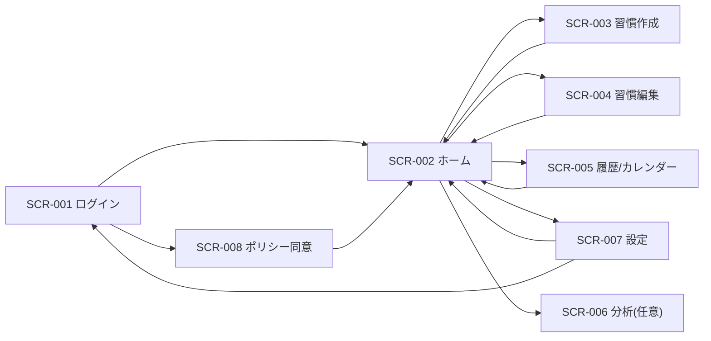

# 画面設計共通

## 0. ドキュメント情報
| 項目 | 内容 |
| -- | -- |
| システム名 | HabiMake |
| 対象範囲 | 詳細設計（画面設計） |
| バージョン | v0.1 |
| 作成日 | 2026-02-11 |
| 作成者 | Codex |
| 承認者 | aliyell |
| 正本トレース起点 | `docs/01_Project_Design/05_Feature_List.md` |

## 1. 画面一覧
| 画面ID | 画面名称 | 概要 | 権限 | URLパス | 関連FNC | 参照ファイル |
| -- | -- | -- | -- | -- | -- | -- |
| SCR-001 | ログイン | Googleログイン開始 | ROLE-001 | `/login` | FNC-001 | [SCR-001_ログイン](./SCR-001_ログイン.md) |
| SCR-002 | ホーム（習慣一覧） | チェックイン・当日状態表示 | ROLE-001 | `/home` | FNC-005,006,007,008 | [SCR-002_ホーム（習慣一覧）](./SCR-002_ホーム（習慣一覧）.md) |
| SCR-003 | 習慣作成 | 習慣新規作成 | ROLE-001 | `/habits/new` | FNC-004 | [SCR-003_習慣作成](./SCR-003_習慣作成.md) |
| SCR-004 | 習慣編集 | 習慣編集/状態遷移 | ROLE-001 | `/habits/:habitId/edit` | FNC-004,006 | [SCR-004_習慣編集](./SCR-004_習慣編集.md) |
| SCR-005 | 履歴/カレンダー | 履歴閲覧・archived切替 | ROLE-001 | `/history` | FNC-008 | [SCR-005_履歴カレンダー](./SCR-005_履歴カレンダー.md) |
| SCR-006 | 分析（任意） | KPI簡易可視化（任意） | ROLE-001 | `/analytics` | FNC-008 | [SCR-006_分析（任意）](./SCR-006_分析（任意）.md) |
| SCR-007 | 設定 | TZ/締め時刻/退会 | ROLE-001 | `/settings` | FNC-010,011,012 | [SCR-007_設定](./SCR-007_設定.md) |
| SCR-008 | ポリシー同意 | terms/privacy同意 | ROLE-001 | `/policy-consent` | FNC-002,003 | [SCR-008_ポリシー同意](./SCR-008_ポリシー同意.md) |

### 1.1 権限マトリクス
| 画面ID | ROLE-001（個人ユーザー） | ROLE-002（運用者） | 備考 |
| -- | -- | -- | -- |
| SCR-001 | 参照/実行可 | 参照のみ | ROLE-002は運用CLI主体 |
| SCR-002 | 参照/更新可 | 不可 | |
| SCR-003 | 参照/更新可 | 不可 | |
| SCR-004 | 参照/更新可 | 不可 | |
| SCR-005 | 参照可 | 不可 | |
| SCR-006 | 参照可（任意） | 不可 | MVP任意 |
| SCR-007 | 参照/更新可 | 不可 | |
| SCR-008 | 参照/更新可 | 不可 | 未同意時のみ必須 |

## 2. 画面遷移図


## 3. 共通仕様
### 3.1 ヘッダー・フッター
- ヘッダー: ロゴ、ホーム、履歴、設定、ログアウト。
- フッター: 利用規約/プライバシーポリシー、コピーライト。

### 3.2 エラー表示規約
| エラー分類 | ステータス | 表示方式 | メッセージ方針 |
| -- | -- | -- | -- |
| 入力エラー | 400 | フィールド下インライン | 修正箇所を明示 |
| 権限エラー | 403 | 画面上部インライン + 監査ログ | 詳細理由は非表示 |
| 業務エラー | 409 | トースト + 必要に応じ導線表示 | 例: archivedは再開導線 |
| 通信エラー | 0/timeout | トースト + 再試行ボタン | リトライ案内 |
| システムエラー | 500 | トースト（共通文言） | trace_id表示 |

### 3.3 バリデーション共通
- timezone: IANA名のみ（ドロップダウン選択）。
- day_cutoff_time: `HH:mm`、`00:00`〜`23:59`。
- habit name: 1〜80文字。

### 3.4 ページネーション・フィルタ
- SCR-005: 月間カレンダー単位、ページネーションなし。
- 履歴一覧は `date desc` 固定、`includeArchived` 切替あり。

### 3.5 アクセシビリティ/レスポンシブ
- 目標: WCAG 2.1 AA（努力目標）。
- 最低対応: キーボード操作、フォーカス表示、色依存禁止。
- ブレークポイント: `sm 640 / md 768 / lg 1024`。

### 3.6 画面共通APIエラー
```json
{
  "code": "FORBIDDEN",
  "message": "アクセス権限がありません",
  "trace_id": "uuid",
  "requirement_id": "FR-025"
}
```

## 4. 画面項目-データ対応
| 代表画面項目 | テーブル.カラム | 備考 |
| -- | -- | -- |
| 習慣名 | habits.name | |
| 習慣状態 | habits.status | active/archived |
| チェックイン日 | habit_logs.log_date | |
| ストリーク | habit_logs + 業務計算 | 永続列なし |
| タイムゾーン | profiles.timezone | |
| 締め時刻 | profiles.day_cutoff_time | |
| 同意版 | policy_settings.current_version / policy_consents.policy_version | |

## 5. 非採用画面ID
- `SCR-009` は `docs/01_Project_Design/05_Feature_List.md` の課題履歴にのみ登場し、2026-02-11の決定でMVP非採用（CLI/SQL運用）として確定済み。

## 改訂履歴
| バージョン | 日付 | 変更内容 | 承認者 |
| -- | -- | -- | -- |
| v0.1 | 2026-02-11 | 初版 | - |
