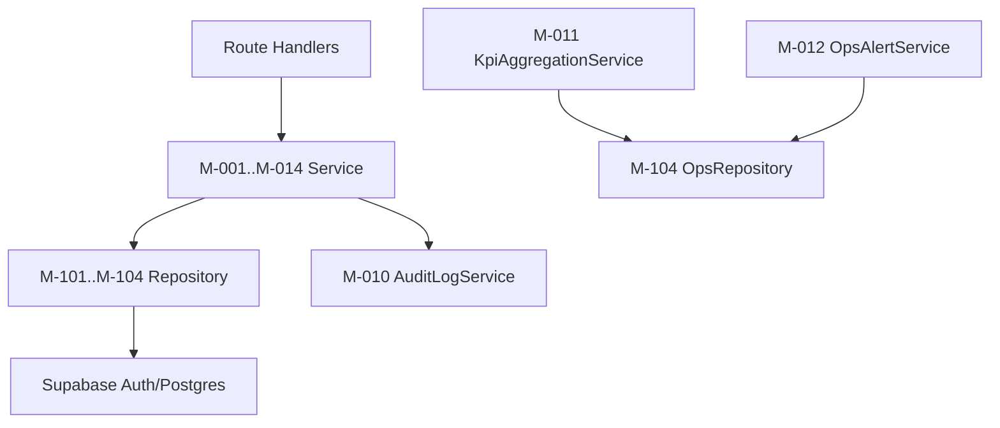

# モジュール設計共通

## 0. ドキュメント情報
| 項目 | 内容 |
| -- | -- |
| システム名 | HabiMake |
| 対象範囲 | 詳細設計（モジュール設計） |
| バージョン | v0.1 |
| 作成日 | 2026-02-11 |
| 作成者 | Codex |
| 承認者 | aliyell |
| 正本トレース起点 | `docs/01_Project_Design/05_Feature_List.md` |

## 1. 設計方針
- 言語: TypeScript。
- アーキテクチャ: Layered（Route Handler -> Application Service -> Repository/Gateway）。
- エラーハンドリング: `AppError(code, message, requirementId, traceId)` を統一。
- トランザクション: Checkin/Withdrawal/Policy更新は明示トランザクション。
- ロギング: JSON構造化（INFO/WARN/ERROR）+ 監査ログ別記録。

## 2. モジュール一覧
| モジュールID | 名称 | 概要 | 責任 | パス/パッケージ | 詳細 |
| -- | -- | -- | -- | -- | -- |
| M-001 | AuthSessionService | ログイン/セッション確立 | 認証制御 | `src/server/application/auth` | [M-001_AuthSessionService](./M-001_AuthSessionService.md) |
| M-002 | ConsentService | 同意判定/同意登録 | 同意制御 | `src/server/application/policy` | [M-002_ConsentService](./M-002_ConsentService.md) |
| M-003 | HabitService | 習慣作成/更新/状態遷移 | 習慣管理 | `src/server/application/habit` | [M-003_HabitService](./M-003_HabitService.md) |
| M-004 | BusinessDateService | 業務日付算出 | TZ/締め時刻判定 | `src/server/domain/time` | [M-004_BusinessDateService](./M-004_BusinessDateService.md) |
| M-005 | CheckinService | チェックイン登録/取消 | 冪等処理 | `src/server/application/checkin` | [M-005_CheckinService](./M-005_CheckinService.md) |
| M-006 | StreakService | ストリーク算出 | 可視化ロジック | `src/server/application/streak` | [M-006_StreakService](./M-006_StreakService.md) |
| M-007 | HistoryService | 履歴取得 | 履歴検索 | `src/server/application/history` | [M-007_HistoryService](./M-007_HistoryService.md) |
| M-008 | SettingsService | TZ/締め時刻更新 | 設定管理 | `src/server/application/settings` | [M-008_SettingsService](./M-008_SettingsService.md) |
| M-009 | WithdrawalService | 二段階退会削除 | 退会処理 | `src/server/application/withdrawal` | [M-009_WithdrawalService](./M-009_WithdrawalService.md) |
| M-010 | AuditLogService | 監査記録出力 | 監査一元化 | `src/server/application/audit` | [M-010_AuditLogService](./M-010_AuditLogService.md) |
| M-011 | KpiAggregationService | 日次集計 | BAT-001/BAT-003 | `src/server/application/kpi` | [M-011_KpiAggregationService](./M-011_KpiAggregationService.md) |
| M-012 | OpsAlertService | 閾値通知送信 | IF-003送信 | `src/server/application/ops` | [M-012_OpsAlertService](./M-012_OpsAlertService.md) |
| M-013 | ReportingService | SQL/CSV抽出 | IF-005出力 | `src/server/application/reporting` | [M-013_ReportingService](./M-013_ReportingService.md) |
| M-014 | AuthorizationPolicyService | API権限制御 | RLS補助判定 | `src/server/application/authz` | [M-014_AuthorizationPolicyService](./M-014_AuthorizationPolicyService.md) |
| M-101 | UserRepository | profiles/user_daily_activity | 永続化 | `src/server/infrastructure/repositories` | [M-101_UserRepository](./M-101_UserRepository.md) |
| M-102 | HabitRepository | habits/habit_logs | 永続化 | `src/server/infrastructure/repositories` | [M-102_HabitRepository](./M-102_HabitRepository.md) |
| M-103 | PolicyRepository | policy_settings/policy_consents | 永続化 | `src/server/infrastructure/repositories` | [M-103_PolicyRepository](./M-103_PolicyRepository.md) |
| M-104 | OpsRepository | audit_logs/analytics_daily_kpi/account_deletion_jobs/monitoring_alert_events | 永続化 | `src/server/infrastructure/repositories` | [M-104_OpsRepository](./M-104_OpsRepository.md) |

## 3. 依存関係図

## 4. トランザクション境界
- `CheckinService.registerCheckin`: habit状態確認 + log upsert + user_daily_activity更新。
- `SettingsService.updateProfileSettings`: profiles更新 + audit_logs記録。
- `WithdrawalService.requestWithdrawal`: account_status無効化 + deletion_job起票 + audit。
- `ConsentService.acceptPolicies`: 同意登録 + 監査記録。

## 改訂履歴
| バージョン | 日付 | 変更内容 | 承認者 |
| -- | -- | -- | -- |
| v0.1 | 2026-02-11 | 初版 | - |
