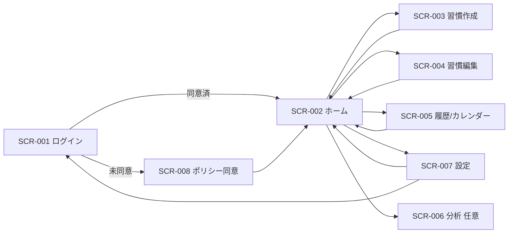

# 1. 概要

## 1.1 目的

- 設計書（`05_Feature_List.md` / `03_Architecture.md` / `04_Basic_Design.md`）を実装可能なタスクへ分解し、依存待ちを最小化する。
- FNC/SCR/IF/TBL へのトレーサビリティを維持したまま、TDD（🔴→🟢→🔵）で品質と速度を両立する。
- クリティカルパスとモック戦略を先に固定し、結合段階での手戻りを最小化する。

## 1.2 成果物（最終ゴール）

- リリース対象: Webアプリ（Next.js）+ API（Route Handlers/Server Actions）+ Supabase DB/Functions
- リリース形態: MVP
- 設計上の目標日: 2026-04-01（予備日: 2026-05-01、`CON-003`）
- 個人開発前提の再見積り: MVP候補 2026-07-10、安定化完了 2026-07-20
- テスト完了目標（再見積り）: ST/UAT完了 2026-06-30

## 1.3 スコープ（In Scope / Out of Scope）

### In Scope

- 機能: `FNC-001`〜`FNC-013`
- 画面: `SCR-001`〜`SCR-008`（`SCR-006`は任意機能）
- IF: `IF-001`〜`IF-005`
- テーブル: `TBL-001`〜`TBL-010`
- バッチ: `BAT-001`, `BAT-003`, `BAT-004`

### Out of Scope

- 課金、コミュニティ、ユーザー向け多チャネル通知
- 専用運用画面（`SCR-009` はMVP非採用、CLI/SQL運用で確定）

## 1.4 前提・制約

> ⚠️ **前提条件の確認**
> 本計画は以下の前提で作成しています。実際と異なる場合は調整が必要です：
> - チーム体制: 個人開発者 1名（フルスタック）
> - 開発期間: MVP 3〜4ヶ月、正式リリース 5ヶ月
> - 外部連携: API仕様確定済み

- 採用前提（設計書に明記あり）:
  - 技術: TypeScript, Next.js, Supabase (Auth/Postgres/Edge Functions), Vercel, GitHub Actions
  - セキュリティ: RLS必須、MVP法令範囲はAPPI、運用MFA必須
  - テスト: E2EはPlaywright、性能はk6、セキュリティは手動チェック中心
  - リリース制約: 2026-04-01固定、破壊的DB変更は同一リリースで禁止
- 採用前提（設計書に明記なしのデフォルト）:
  - チーム体制: 個人開発者 1名（設計/実装/テスト/運用を兼務）
  - 開発環境準備状況: 新規構築（Phase 1で対応）
  - データ移行: なし（新規プロダクト前提）
  - テストカバレッジ基準: C0 80%以上（Domain/UseCase中心）
- 重要補足:
  - `04_Basic_Design.md` の粗粒度FNC（`FNC-001..009`）に対し、実装トレースは `05_Feature_List.md` の詳細粒度（`FNC-001..013`）を正本とする。
  - `CON-003` の目標日（2026-04-01）は1人体制では高リスクのため、Must機能優先または期日再合意が必要。

## 1.5 参照ドキュメント

- `docs/01_Project_Design/05_Feature_List.md`
- `docs/01_Project_Design/03_Architecture.md`
- `docs/01_Project_Design/04_Basic_Design.md`
- `docs/02_Detailed_Design/06_Data_Design/00_Data_Common.md`
- `docs/02_Detailed_Design/07_Screen_Design/00_Screen_Common.md`
- `docs/02_Detailed_Design/08_Interface_Design/00_Interface_Common.md`
- `docs/01_Project_Design/12_Test_Plan.md`
- `docs/01_Project_Design/10_Security_Design.md`

## 1.6 初期要約（設計書抽出）

### (a) 理解したことの要約

- 対象機能数: `13`（`FNC-001..013`）
- 対象画面数: `8`（`SCR-001..008`、`SCR-009`はMVP非採用）
- 対象API数: `5`（`IF-001..005`）
- 対象テーブル数: `10`（`TBL-001..010`）
- 技術スタック概要: TypeScript / Next.js / Supabase / Vercel / GitHub Actions / Playwright / k6
- 主要依存関係（クリティカルパス候補）:
- `FNC-013 -> FNC-001 -> FNC-002/003 -> SCR-002`
- `FNC-004 -> FNC-005 -> FNC-006/007 -> FNC-008 -> E2E`
- `FNC-012 + BAT-004 + IF-005 -> 退会SLA試験 -> リリース判定`

### (b) 設計書から抽出した情報

- チーム体制:
- 役割定義（テストマネージャ/QA/開発/運用）は記載あり、開発人数の明記はなし
- リリース期日/マイルストーン:
- 目標 `2026-04-01`、予備日 `2026-05-01`（要件制約）
- ST/UAT実施期間 `2026-03-15〜2026-03-31`（テスト計画）
- 既存資産/移行要件:
- 新規プロダクト前提、既存移行なし
- 外部連携先の確定状況:
- `IF-003`, `IF-005` は詳細設計で確定
- `IF-001` は本番OAuth設定（DEP-001）が残課題

### (c) 採用する前提条件

- チーム体制の前提: 個人開発者1名（フルスタック）
- 開発期間の前提: MVP 3〜4ヶ月、正式リリース5ヶ月
- 外部連携: API仕様確定済み、Sandbox利用可能と仮定
- 前提差異がある場合: 工数、Phase期間、モック除去期限の再調整が必要

### (d) 提案する実装フェーズ概要

- フェーズ分割: Phase 1（基盤）〜Phase 8（リリース後改善）
- 論理並行（時間分割）可能群:
- 認証/同意群（`FNC-001..003`）
- 習慣/チェックイン群（`FNC-004..008`）
- 設定/退会/運用群（`FNC-009..012`）
- クリティカルパス識別:
- 認証同意経路（起動導線）
- チェックイン可視化経路（コア価値）
- 退会SLA経路（法令/信頼性）

---

# 2. 依存関係の整理（最重要）

## 2.1 機能・画面一覧（カタログ）

### 機能カタログ（FNC-ID）

- `FNC-001` Google認証セッション確立
- `FNC-002` 同意判定・同意強制
- `FNC-003` 同意履歴管理
- `FNC-004` 習慣管理（作成/更新/アーカイブ/再開）
- `FNC-005` 業務日付算出
- `FNC-006` チェックイン登録・冪等・状態制御
- `FNC-007` チェックイン取消
- `FNC-008` 継続可視化（ストリーク/履歴）
- `FNC-009` 運用通知（閾値）
- `FNC-010` 設定管理（TZ/締め時刻/検証）
- `FNC-011` 設定変更監査
- `FNC-012` 退会処理（不可化/削除）
- `FNC-013` アクセス制御・監査必須項目

### 画面カタログ（SCR-ID）

- `SCR-001` ログイン
- `SCR-002` ホーム（習慣一覧）
- `SCR-003` 習慣作成
- `SCR-004` 習慣編集
- `SCR-005` 履歴/カレンダー
- `SCR-006` 分析（任意）
- `SCR-007` 設定
- `SCR-008` ポリシー同意
- 注記: `SCR-009` はMVP非採用（課題履歴上の非採用ID）

### IFカタログ（IF-ID）

- `IF-001` 認証セッション確立
- `IF-002` アプリ業務データAPI
- `IF-003` 監視通知メール
- `IF-004` policy_settings更新
- `IF-005` 運用CLI/SQL

### テーブルカタログ（TBL-ID）

- `TBL-001` profiles
- `TBL-002` habits
- `TBL-003` habit_logs
- `TBL-004` user_daily_activity
- `TBL-005` analytics_daily_kpi
- `TBL-006` policy_settings
- `TBL-007` policy_consents
- `TBL-008` audit_logs
- `TBL-009` account_deletion_jobs
- `TBL-010` monitoring_alert_events

## 2.2 依存関係マトリクス

| ID | 種別 | 名称 | 依存（前提） | 後続（これを待つ） | 備考 |
| :--- | :--- | :--- | :--- | :--- | :--- |
| FNC-001 | 機能 | Google認証セッション確立 | IF-001, SCR-001 | FNC-002, SCR-008, SCR-002 | 認証起点 |
| FNC-002 | 機能 | 同意判定・同意強制 | FNC-001, IF-004, TBL-006 | FNC-003, SCR-008, SCR-002 | 未同意時は同意画面へ強制 |
| FNC-003 | 機能 | 同意履歴管理 | FNC-002, TBL-007, TBL-008 | RPT-002, IF-005 | 同意履歴一意制約 |
| FNC-004 | 機能 | 習慣管理 | FNC-013, IF-002, TBL-002 | FNC-006, SCR-003, SCR-004 | status遷移整合 |
| FNC-005 | 機能 | 業務日付算出 | TBL-001, IF-002 | FNC-006, FNC-007 | TZ+締め時刻境界 |
| FNC-006 | 機能 | チェックイン登録・冪等・状態制御 | FNC-004, FNC-005, TBL-003 | FNC-008, SCR-002 | 冪等/active制御 |
| FNC-007 | 機能 | チェックイン取消 | FNC-005, FNC-006, TBL-003 | FNC-008, SCR-002 | 当日分のみ |
| FNC-008 | 機能 | 継続可視化 | FNC-006, FNC-007, TBL-002, TBL-003 | SCR-005, SCR-006, BAT-001 | SCR-006は任意 |
| FNC-009 | 機能 | 運用通知（閾値） | BAT-003, IF-003, IF-005, TBL-005, TBL-010 | RPT-001, RPT-002 | MVPは画面なし |
| FNC-010 | 機能 | 設定管理 | IF-002, TBL-001, SCR-007 | FNC-011, FNC-005 | cutoff変更後適用 |
| FNC-011 | 機能 | 設定変更監査 | FNC-010, TBL-008, IF-005 | RPT-002 | 監査必須項目 |
| FNC-012 | 機能 | 退会処理 | FNC-013, IF-005, BAT-004, TBL-009 | SCR-001, 運用監視 | 60秒不可化+5分削除 |
| FNC-013 | 機能 | アクセス制御・監査必須項目 | RLS方針, TBL-008, IF-002 | 全FNC, 全SCR | 全体の基盤依存 |
| SCR-001 | 画面 | ログイン | IF-001 | SCR-008, SCR-002 | 同意判定で遷移分岐 |
| SCR-002 | 画面 | ホーム | FNC-005, FNC-006, FNC-007, FNC-008 | SCR-003, SCR-004, SCR-005, SCR-007 | MVP中心導線 |
| SCR-003 | 画面 | 習慣作成 | FNC-004, IF-002 | SCR-002 | 入力検証 |
| SCR-004 | 画面 | 習慣編集 | FNC-004, FNC-006, IF-002 | SCR-002 | active/archived制御 |
| SCR-005 | 画面 | 履歴/カレンダー | FNC-008, IF-002 | SCR-002 | includeArchived切替 |
| SCR-006 | 画面 | 分析（任意） | FNC-008, IF-002 | SCR-002 | 任意機能 |
| SCR-007 | 画面 | 設定 | FNC-010, FNC-011, FNC-012 | SCR-002, SCR-001 | 退会導線あり |
| SCR-008 | 画面 | ポリシー同意 | FNC-002, FNC-003, IF-004 | SCR-002, SCR-001 | 未同意時のみ必須 |
| IF-001 | IF | 認証セッション確立 | Google OAuth設定（DEP-001） | FNC-001, SCR-001 | 外部依存 |
| IF-002 | IF | 業務データAPI | RLS, TBL-001..009 | FNC-002..008,010..013 | 最広範依存 |
| IF-003 | IF | 監視通知メール | TBL-010, BAT-003 | FNC-009 | 再送制御あり |
| IF-004 | IF | policy_settings更新 | service role, TBL-006, TBL-008 | FNC-002, FNC-003 | 監査必須 |
| IF-005 | IF | 運用CLI/SQL | ROLE-002, TBL-005, TBL-008, TBL-009 | FNC-009, FNC-011, FNC-012 | 手動実行のみ |
| TBL-001 | TBL | profiles | auth.users | FNC-005, FNC-010, FNC-012 | TZ/締め時刻・退会状態 |
| TBL-002 | TBL | habits | TBL-001 | FNC-004, FNC-006, FNC-008 | 習慣ライフサイクル |
| TBL-003 | TBL | habit_logs | TBL-001, TBL-002 | FNC-006, FNC-007, FNC-008 | 冪等キー対象 |
| TBL-004 | TBL | user_daily_activity | TBL-001, TBL-003, BAT-001 | FNC-009, FNC-012 | 日次集計 |
| TBL-005 | TBL | analytics_daily_kpi | TBL-004, BAT-001 | FNC-009, IF-005 | 匿名KPI |
| TBL-006 | TBL | policy_settings | 初期Seed(IF-004) | FNC-002, FNC-003 | 同意版の正本 |
| TBL-007 | TBL | policy_consents | TBL-001, TBL-006 | FNC-003, FNC-012 | 同意履歴 |
| TBL-008 | TBL | audit_logs | 全操作 | FNC-011, FNC-013, IF-005 | 横断監査 |
| TBL-009 | TBL | account_deletion_jobs | TBL-001, BAT-004 | FNC-012, IF-005 | 退会SLA追跡 |
| TBL-010 | TBL | monitoring_alert_events | TBL-005, IF-003 | FNC-009 | 通知履歴 |

## 2.3 画面遷移（Mermaid）

### クリティカルパス

- CP-1: `Phase1基盤` -> `FNC-013(RLS/監査)` -> `FNC-001` -> `FNC-002/003` -> `SCR-002到達`
- CP-2: `FNC-004` -> `FNC-005` -> `FNC-006/007` -> `FNC-008` -> `主要導線E2E`
- CP-3: `FNC-012` + `BAT-004` + `IF-005` -> `退会SLA試験` -> `リリース判定`

### 並行作業グループ

- G-A（認証・同意）: `FNC-001/002/003`, `SCR-001/008`, `IF-001/004`, `TBL-006/007/008`
- G-B（習慣・チェックイン）: `FNC-004/005/006/007/008`, `SCR-002/003/004/005/006`, `TBL-001/002/003/004`
- G-C（設定・退会・運用）: `FNC-010/011/012/009`, `SCR-007`, `IF-003/005`, `TBL-005/009/010`
- 注記: 個人開発では同時並行ではなく、`G-A -> G-B -> G-C` を基本に時間分割で進行する。

---

# 3. モック方針（遷移先がスコープ外/未実装の場合）

## 3.1 ルール

- 目的は「依存切断」ではなく「契約固定（Contract固定）」とする。
- モックは API契約（入力/出力/エラーコード）を本実装と一致させる。
- モック利用中のPRは `TODO:REMOVE_MOCK(<MockID>)` を必須記載する。
- モックの新規追加時は、同PRで除去タスク（Phase 5配下）を同時起票する。

## 3.2 モックの定義

| モックID | 対象 | 責務範囲 | 置き換え条件 | モック除去の責務・期限 |
| :--- | :--- | :--- | :--- | :--- |
| S-MOCK-01 | IF-001（Google OAuth） | 認証成功/失敗レスポンス、テストセッション払い出し | DEP-001（本番OAuth設定）完了 + Stg疎通OK | 担当: 個人開発者, 期限: Phase 5開始前（2026-03-15） |
| S-MOCK-02 | IF-003（通知送信） | 送信受付/失敗/再送の擬似挙動 | Edge Functions疎通 + 通知先検証OK | 担当: 個人開発者, 期限: 2026-03-17 |
| S-MOCK-03 | IF-005（運用SQL） | CSV生成の固定データ返却 | ROLE-002権限で実SQL実行成功 | 担当: 個人開発者, 期限: 2026-03-18 |
| S-MOCK-04 | SCR-006（任意画面） | プレースホルダUIと導線維持 | FNC-008可視化API安定化 | 担当: 個人開発者, 期限: 2026-03-20 |
| S-MOCK-05 | BAT-004（退会削除ジョブ） | ジョブ状態遷移の擬似実行 | 実ジョブで60秒/5分SLA合格 | 担当: 個人開発者, 期限: 2026-03-21 |

### モック除去ゲート

- Phase 5終了時点で `S-MOCK-*` 残件0をリリース必須条件とする。
- 残件が出た場合は `P0欠陥` としてリリースNo-Go。

---

# 4. フェーズ別 実装計画（TDD: テスト駆動開発）

## TDDの基本原則

- すべての機能実装は `🔴 Red（失敗テスト） -> 🟢 Green（最小実装） -> 🔵 Refactor（整理）` の順で実施。
- テストなし実装は原則禁止（例外はPhase 1の基盤セットアップのみ）。
- PR単位で「対象ID」「テスト証跡」「カバレッジ変化」を必須記録。
- 1人体制のため、1タスク完了（🔴🟢🔵）ごとに次タスクへ進み、マルチタスクを避ける。

## テストカバレッジ基準

| レイヤー | 最低基準 | 補足 |
| :--- | :--- | :--- |
| Domain / UseCase | 80%以上 | C0基準、分岐が多い箇所は境界値を追加 |
| API Handler | 70%以上 | 403/409/500系を必須網羅 |
| UI Component | 60%以上 | 主要導線とエラー表示を優先 |
| E2E（主要導線） | 100% | ログイン→同意→ホーム→チェックイン→設定→退会 |

## Phase 1: プロジェクトセットアップ & テスト基盤構築

- 期間目安: 2026-02-11〜2026-02-18
- 工数目安: 11〜14人日
- 期間目安（個人開発）: 2026-02-11〜2026-02-28

| 優先 | タスクID | 対象 | 依存 | 内容（ざっくり） | TDDステップ | 担当 | PR/Issue |
| :--- | :--- | :--- | :--- | :--- | :--- | :--- | :--- |
| P0 | T-001 | Repo | - | リポジトリ初期設定、ブランチ運用、CODEOWNERS整備（1.0人日） | 基盤 | 個人開発者 | Issue#T-001 |
| P0 | T-002 | Env | T-001 | Dev/Stg/Prod雛形、Secrets管理方針（1.5人日） | 基盤 | 個人開発者 | Issue#T-002 |
| P0 | T-003 | Test | T-001 | Unit/ITテスト基盤導入（2.0人日） | 基盤 | 個人開発者 | Issue#T-003 |
| P0 | T-004 | E2E | T-003 | Playwright基盤 + スモーク雛形（1.5人日） | 基盤 | 個人開発者 | Issue#T-004 |
| P0 | T-005 | CI/CD | T-003 | GitHub Actions（lint/typecheck/test/build）導入（1.5人日） | 基盤 | 個人開発者 | Issue#T-005 |
| P1 | T-006 | DB | T-002 | Supabase CLI・migration雛形・seed導入（1.5人日） | 基盤 | 個人開発者 | Issue#T-006 |
| P1 | T-007 | Security | T-005 | Dependabot/secret scan/CSPヘッダ雛形（1.0人日） | 基盤 | 個人開発者 | Issue#T-007 |
| P1 | T-008 | Test Data | T-003 | テストフィクスチャ戦略（USER-A/B/ROLE-002）整備（1.0人日） | 基盤 | 個人開発者 | Issue#T-008 |
| P2 | T-009 | Docs | T-001 | PRテンプレにIDトレース項目追加（0.5人日） | 基盤 | 個人開発者 | Issue#T-009 |

## Phase 2: 画面遷移の骨格（テストファースト）

- 期間目安: 2026-02-19〜2026-02-25
- 工数目安: 12〜15人日
- 期間目安（個人開発）: 2026-03-01〜2026-03-15

| 優先 | タスクID | 対象 | 依存 | 内容（ざっくり） | TDDステップ | 担当 | PR/Issue |
| :--- | :--- | :--- | :--- | :--- | :--- | :--- | :--- |
| P0 | T-010 | SCR-001..008 | T-003 | ルーティング/遷移テスト作成（`SCR-001..008`）（1.5人日） | 🔴 Red | 個人開発者 | Issue#T-010 |
| P0 | T-011 | SCR-001..008 | T-010 | 画面コンテナ実装（空画面 + path紐付け）（1.5人日） | 🟢 Green | 個人開発者 | Issue#T-011 |
| P0 | T-012 | FNC-001/002 | T-003 | 認証/同意ガードの失敗テスト（未認証・未同意）（1.0人日） | 🔴 Red | 個人開発者 | Issue#T-012 |
| P0 | T-013 | FNC-001/002 | T-012 | 認証/同意ガード実装（`SCR-001->SCR-008->SCR-002`）（1.5人日） | 🟢 Green | 個人開発者 | Issue#T-013 |
| P1 | T-014 | 共通UI | T-003 | ヘッダー/フッター/エラー表示コンポーネントテスト（1.0人日） | 🔴 Red | 個人開発者 | Issue#T-014 |
| P1 | T-015 | 共通UI | T-014 | 共通UI実装 + `trace_id`表示導線（1.0人日） | 🟢 Green | 個人開発者 | Issue#T-015 |
| P1 | T-016 | S-MOCK-04 | T-011 | 任意画面/未実装遷移のモック画面作成（0.5人日） | 🟢 Green | 個人開発者 | Issue#T-016 |
| P1 | T-017 | Phase2 | T-013,T-015 | 画面骨格の重複整理・テスト高速化（1.0人日） | 🔵 Refactor | 個人開発者 | Issue#T-017 |

## Phase 3: ドメイン基盤（API/DB/共通モジュール）

- 期間目安: 2026-02-23〜2026-03-07
- 工数目安: 18〜22人日
- 期間目安（個人開発）: 2026-03-16〜2026-04-10

| 優先 | タスクID | 対象 | 依存 | 内容（ざっくり） | TDDステップ | 担当 | PR/Issue |
| :--- | :--- | :--- | :--- | :--- | :--- | :--- | :--- |
| P0 | T-018 | TBL-001..003 | T-006 | CoreテーブルDDLテスト（profiles/habits/habit_logs）（1.5人日） | 🔴 Red | 個人開発者 | Issue#T-018 |
| P0 | T-019 | TBL-001..003 | T-018 | Coreテーブル実装 + index/unique制約（1.5人日） | 🟢 Green | 個人開発者 | Issue#T-019 |
| P0 | T-020 | TBL-006..008 | T-006 | 同意/監査テーブルDDLテスト（1.0人日） | 🔴 Red | 個人開発者 | Issue#T-020 |
| P0 | T-021 | TBL-006..008 | T-020 | 同意/監査テーブル実装（1.0人日） | 🟢 Green | 個人開発者 | Issue#T-021 |
| P0 | T-022 | TBL-004,005,009,010 | T-006 | 集計/退会/通知テーブルDDLテスト（1.5人日） | 🔴 Red | 個人開発者 | Issue#T-022 |
| P0 | T-023 | TBL-004,005,009,010 | T-022 | 集計/退会/通知テーブル実装（1.5人日） | 🟢 Green | 個人開発者 | Issue#T-023 |
| P0 | T-024 | M-101..104 | T-019,T-021,T-023 | Repositoryテスト（CRUD, Tx, 競合）（2.0人日） | 🔴 Red | 個人開発者 | Issue#T-024 |
| P0 | T-025 | M-101..104 | T-024 | Repository実装（2.0人日） | 🟢 Green | 個人開発者 | Issue#T-025 |
| P0 | T-026 | IF-002 | T-003 | API DTO/Validationテスト（403/409/500含む）（1.5人日） | 🔴 Red | 個人開発者 | Issue#T-026 |
| P0 | T-027 | IF-002 | T-026 | API DTO/Validation実装（1.5人日） | 🟢 Green | 個人開発者 | Issue#T-027 |
| P0 | T-028 | FNC-013 | T-025 | 認可ポリシー/RLS SQL試験作成（2.0人日） | 🔴 Red | 個人開発者 | Issue#T-028 |
| P0 | T-029 | FNC-013 | T-028 | RLS/AuthorizationPolicy実装（2.0人日） | 🟢 Green | 個人開発者 | Issue#T-029 |
| P1 | T-030 | 共通基盤 | T-027 | 共通エラーハンドリング・監査アサート試験（1.0人日） | 🔴 Red | 個人開発者 | Issue#T-030 |
| P1 | T-031 | 共通基盤 | T-030 | AppError/trace_id/監査ロガー実装（1.0人日） | 🟢 Green | 個人開発者 | Issue#T-031 |
| P1 | T-032 | Phase3 | T-029,T-031 | ドメイン基盤リファクタ + 速度改善（1.0人日） | 🔵 Refactor | 個人開発者 | Issue#T-032 |

## Phase 4: 機能実装（TDDサイクルで進める）

- 期間目安: 2026-03-01〜2026-03-21
- 工数目安: 30〜38人日
- 実装方針: 機能クラスター単位で順次実装し、各クラスター内で🔴🟢🔵を完結させる。
- 期間目安（個人開発）: 2026-04-11〜2026-05-31

| 優先 | タスクID | 対象 | 依存 | 内容（ざっくり） | TDDステップ | 担当 | PR/Issue |
| :--- | :--- | :--- | :--- | :--- | :--- | :--- | :--- |
| P0 | T-033 | FNC-001,IF-001,SCR-001 | T-029 | 認証UseCase/API/UIテスト作成（1.5人日） | 🔴 Red | 個人開発者 | Issue#T-033 |
| P0 | T-034 | FNC-001,IF-001,SCR-001 | T-033 | 認証実装（start/login callback/logout）（1.5人日） | 🟢 Green | 個人開発者 | Issue#T-034 |
| P1 | T-035 | FNC-001 | T-034 | 認証実装リファクタ（監査/例外統一）（0.5人日） | 🔵 Refactor | 個人開発者 | Issue#T-035 |
| P0 | T-036 | FNC-002,FNC-003,SCR-008,IF-004,TBL-006,TBL-007 | T-029 | 同意判定/同意履歴テスト作成（1.5人日） | 🔴 Red | 個人開発者 | Issue#T-036 |
| P0 | T-037 | FNC-002,FNC-003,SCR-008,IF-004 | T-036 | 同意判定・同意登録・拒否導線実装（1.5人日） | 🟢 Green | 個人開発者 | Issue#T-037 |
| P1 | T-038 | FNC-002,FNC-003 | T-037 | 同意版更新競合ケースの整理（0.5人日） | 🔵 Refactor | 個人開発者 | Issue#T-038 |
| P0 | T-039 | FNC-004,SCR-003,SCR-004,TBL-002 | T-032 | 習慣管理テスト（作成/更新/アーカイブ/再開）（1.5人日） | 🔴 Red | 個人開発者 | Issue#T-039 |
| P0 | T-040 | FNC-004,SCR-003,SCR-004 | T-039 | 習慣管理実装（1.5人日） | 🟢 Green | 個人開発者 | Issue#T-040 |
| P1 | T-041 | FNC-004 | T-040 | 習慣状態遷移のリファクタ（0.5人日） | 🔵 Refactor | 個人開発者 | Issue#T-041 |
| P0 | T-042 | FNC-005,M-004,TBL-001 | T-032 | 業務日付算出テスト（cutoff境界）（1.0人日） | 🔴 Red | 個人開発者 | Issue#T-042 |
| P0 | T-043 | FNC-005 | T-042 | 業務日付算出実装（1.0人日） | 🟢 Green | 個人開発者 | Issue#T-043 |
| P1 | T-044 | FNC-005 | T-043 | 日付計算ロジック整理（0.5人日） | 🔵 Refactor | 個人開発者 | Issue#T-044 |
| P0 | T-045 | FNC-006,SCR-002,IF-002,TBL-003 | T-043,T-040 | チェックイン登録/冪等/archived拒否テスト（2.0人日） | 🔴 Red | 個人開発者 | Issue#T-045 |
| P0 | T-046 | FNC-006,SCR-002 | T-045 | チェックイン実装（2.0人日） | 🟢 Green | 個人開発者 | Issue#T-046 |
| P1 | T-047 | FNC-006 | T-046 | 冪等競合の整理（0.5人日） | 🔵 Refactor | 個人開発者 | Issue#T-047 |
| P0 | T-048 | FNC-007,SCR-002,TBL-003 | T-046 | 当日取消テスト（1.0人日） | 🔴 Red | 個人開発者 | Issue#T-048 |
| P0 | T-049 | FNC-007,SCR-002 | T-048 | 当日取消実装（1.0人日） | 🟢 Green | 個人開発者 | Issue#T-049 |
| P1 | T-050 | FNC-007 | T-049 | 取消条件ロジック整理（0.5人日） | 🔵 Refactor | 個人開発者 | Issue#T-050 |
| P1 | T-051 | FNC-008,SCR-005,SCR-006,TBL-004 | T-046,T-049 | ストリーク/履歴表示テスト（1.5人日） | 🔴 Red | 個人開発者 | Issue#T-051 |
| P1 | T-052 | FNC-008,SCR-005,SCR-006 | T-051 | 可視化実装（SCR-006は任意モック継続可）（1.5人日） | 🟢 Green | 個人開発者 | Issue#T-052 |
| P2 | T-053 | FNC-008 | T-052 | 可視化クエリ最適化（0.5人日） | 🔵 Refactor | 個人開発者 | Issue#T-053 |
| P1 | T-054 | FNC-010,FNC-011,SCR-007,TBL-001,TBL-008 | T-031 | 設定更新/監査テスト（1.5人日） | 🔴 Red | 個人開発者 | Issue#T-054 |
| P1 | T-055 | FNC-010,FNC-011,SCR-007 | T-054 | TZ/締め時刻更新 + 監査実装（1.5人日） | 🟢 Green | 個人開発者 | Issue#T-055 |
| P1 | T-056 | FNC-010,FNC-011 | T-055 | 設定監査整形（0.5人日） | 🔵 Refactor | 個人開発者 | Issue#T-056 |
| P0 | T-057 | FNC-012,BAT-004,IF-005,TBL-009 | T-029,T-055 | 退会SLAテスト（60秒不可化/5分削除）（2.0人日） | 🔴 Red | 個人開発者 | Issue#T-057 |
| P0 | T-058 | FNC-012,SCR-007,SCR-001,TBL-009 | T-057 | 退会API + ジョブ実装（2.0人日） | 🟢 Green | 個人開発者 | Issue#T-058 |
| P0 | T-059 | FNC-012 | T-058 | 退会失敗再実行設計の整理（0.5人日） | 🔵 Refactor | 個人開発者 | Issue#T-059 |
| P1 | T-060 | FNC-009,IF-003,IF-005,TBL-005,TBL-010 | T-023 | 閾値通知/KPI抽出テスト（1.5人日） | 🔴 Red | 個人開発者 | Issue#T-060 |
| P1 | T-061 | FNC-009,IF-003,IF-005 | T-060 | 閾値通知/運用抽出実装（1.5人日） | 🟢 Green | 個人開発者 | Issue#T-061 |
| P2 | T-062 | FNC-009 | T-061 | 通知再送ロジック整理（0.5人日） | 🔵 Refactor | 個人開発者 | Issue#T-062 |
| P0 | T-063 | FNC-013,全API | T-034,T-037,T-040,T-046,T-058 | 横断RLS/監査回帰テスト追加（1.5人日） | 🔴 Red | 個人開発者 | Issue#T-063 |
| P0 | T-064 | FNC-013,全API | T-063 | 認可/監査の横断修正（1.5人日） | 🟢 Green | 個人開発者 | Issue#T-064 |
| P0 | T-065 | FNC-013 | T-064 | セキュリティ観点リファクタ（0.5人日） | 🔵 Refactor | 個人開発者 | Issue#T-065 |

## Phase 5: 結合テスト & E2Eテスト

- 期間目安: 2026-03-15〜2026-03-24
- 工数目安: 10〜13人日
- 期間目安（個人開発）: 2026-06-01〜2026-06-15

| 優先 | タスクID | 対象 | 依存 | 内容（ざっくり） | TDDステップ | 担当 | PR/Issue |
| :--- | :--- | :--- | :--- | :--- | :--- | :--- | :--- |
| P0 | T-066 | E2E主要導線 | T-065 | 主要導線E2E失敗テスト作成（1.5人日） | 🔴 Red | 個人開発者 | Issue#T-066 |
| P0 | T-067 | E2E主要導線 | T-066 | 主要導線結合実装（1.5人日） | 🟢 Green | 個人開発者 | Issue#T-067 |
| P0 | T-068 | S-MOCK-01/02/03/05 | T-067 | モック除去テスト作成（1.0人日） | 🔴 Red | 個人開発者 | Issue#T-068 |
| P0 | T-069 | S-MOCK-01/02/03/05 | T-068 | モック除去・実IF接続（1.5人日） | 🟢 Green | 個人開発者 | Issue#T-069 |
| P1 | T-070 | 異常系境界 | T-067 | 境界値/異常系IT追加（1.5人日） | 🔴 Red | 個人開発者 | Issue#T-070 |
| P1 | T-071 | 異常系境界 | T-070 | 例外系修正（1.0人日） | 🟢 Green | 個人開発者 | Issue#T-071 |
| P1 | T-072 | Phase5 | T-069,T-071 | 結合テスト最適化（0.5人日） | 🔵 Refactor | 個人開発者 | Issue#T-072 |

## Phase 6: 品質担保（テストカバレッジ & セキュリティ）

- 期間目安: 2026-03-20〜2026-03-27
- 工数目安: 8〜11人日
- 期間目安（個人開発）: 2026-06-16〜2026-06-30

| 優先 | タスクID | 対象 | 依存 | 内容（ざっくり） | TDDステップ | 担当 | PR/Issue |
| :--- | :--- | :--- | :--- | :--- | :--- | :--- | :--- |
| P0 | T-073 | Coverage | T-072 | カバレッジ不足箇所の失敗テスト追加（1.5人日） | 🔴 Red | 個人開発者 | Issue#T-073 |
| P0 | T-074 | Coverage | T-073 | カバレッジ基準達成の実装修正（1.0人日） | 🟢 Green | 個人開発者 | Issue#T-074 |
| P0 | T-075 | Security | T-072 | 手動セキュリティ試験（RLS/認証/監査）ケース追加（1.0人日） | 🔴 Red | 個人開発者 | Issue#T-075 |
| P0 | T-076 | Security | T-075 | 脆弱性対処（重大/高=0）実装修正（1.0人日） | 🟢 Green | 個人開発者 | Issue#T-076 |
| P1 | T-077 | Performance | T-072 | k6性能試験シナリオ作成（1.0人日） | 🔴 Red | 個人開発者 | Issue#T-077 |
| P1 | T-078 | Performance | T-077 | 性能閾値未達への改善（1.0人日） | 🟢 Green | 個人開発者 | Issue#T-078 |
| P1 | T-079 | Regression | T-072 | 回帰自動化拡張（nightly対象）（1.0人日） | 改善 | 個人開発者 | Issue#T-079 |
| P1 | T-080 | Phase6 | T-074,T-076,T-078 | 品質改善リファクタ（0.5人日） | 🔵 Refactor | 個人開発者 | Issue#T-080 |

## Phase 7: リリース準備 & リリース

- 期間目安: 2026-03-27〜2026-04-01
- 工数目安: 6〜8人日
- 期間目安（個人開発）: 2026-07-01〜2026-07-10

| 優先 | タスクID | 対象 | 依存 | 内容（ざっくり） | TDDステップ | 担当 | PR/Issue |
| :--- | :--- | :--- | :--- | :--- | :--- | :--- | :--- |
| P0 | T-081 | Release Gate | T-080 | 全テスト通過確認、未解決P1/P2=0確認（0.5人日） | 検証 | 個人開発者 | Issue#T-081 |
| P0 | T-082 | DB Migration | T-081 | マイグレーションリハーサル（Expand/Contract）（1.0人日） | 検証 | 個人開発者 | Issue#T-082 |
| P0 | T-083 | Deploy | T-082 | 本番リリース手順実行（1.0人日） | 検証 | 個人開発者 | Issue#T-083 |
| P0 | T-084 | Smoke | T-083 | 本番スモーク（ログイン/同意/チェックイン/退会）（1.0人日） | 検証 | 個人開発者 | Issue#T-084 |
| P1 | T-085 | Runbook | T-081 | 運用手順・障害連絡網最終更新（0.5人日） | 改善 | 個人開発者 | Issue#T-085 |

## Phase 8: リリース後 & テスト改善

- 期間目安: 2026-04-02〜2026-04-08
- 工数目安: 3〜5人日
- 期間目安（個人開発）: 2026-07-11〜2026-07-20

| 優先 | タスクID | 対象 | 依存 | 内容（ざっくり） | TDDステップ | 担当 | PR/Issue |
| :--- | :--- | :--- | :--- | :--- | :--- | :--- | :--- |
| P1 | T-086 | Hypercare | T-084 | リリース後監視・不具合即応（1.0人日） | 検証 | 個人開発者 | Issue#T-086 |
| P1 | T-087 | KPT | T-086 | KPT振り返り、改善バックログ化（0.5人日） | 改善 | 個人開発者 | Issue#T-087 |
| P2 | T-088 | Tech Debt | T-087 | モック由来負債・性能負債の棚卸し（0.5人日） | 改善 | 個人開発者 | Issue#T-088 |

## FNCトレーサビリティ（機能 -> タスクID）

| 機能ID | 対象画面/IF/TBL（主要） | 実装タスクID | 備考 |
| :--- | :--- | :--- | :--- |
| FNC-001 | `SCR-001`, `IF-001` | `T-033`, `T-034`, `T-035` | 認証フロー |
| FNC-002 | `SCR-008`, `IF-004`, `TBL-006` | `T-036`, `T-037`, `T-038` | 同意判定 |
| FNC-003 | `SCR-008`, `TBL-007`, `TBL-008` | `T-036`, `T-037`, `T-038` | 同意履歴 |
| FNC-004 | `SCR-003`, `SCR-004`, `TBL-002` | `T-039`, `T-040`, `T-041` | 習慣管理 |
| FNC-005 | `SCR-002`, `TBL-001` | `T-042`, `T-043`, `T-044` | 業務日付 |
| FNC-006 | `SCR-002`, `IF-002`, `TBL-003` | `T-045`, `T-046`, `T-047` | 登録/冪等 |
| FNC-007 | `SCR-002`, `TBL-003` | `T-048`, `T-049`, `T-050` | 取消 |
| FNC-008 | `SCR-005`, `SCR-006`, `TBL-004` | `T-051`, `T-052`, `T-053` | 可視化 |
| FNC-009 | `IF-003`, `IF-005`, `TBL-005`, `TBL-010` | `T-060`, `T-061`, `T-062` | 運用通知/KPI |
| FNC-010 | `SCR-007`, `TBL-001` | `T-054`, `T-055`, `T-056` | 設定更新 |
| FNC-011 | `SCR-007`, `TBL-008`, `IF-005` | `T-054`, `T-055`, `T-056` | 設定監査 |
| FNC-012 | `SCR-007`, `BAT-004`, `TBL-009` | `T-057`, `T-058`, `T-059` | 退会二段階削除 |
| FNC-013 | `IF-002`, `TBL-008` | `T-028`, `T-029`, `T-063`, `T-064`, `T-065` | RLS/監査横断 |

## TDDチェックリスト（各PR必須）

- [ ] 対象ID（FNC/SCR/IF/TBL）をPR本文に記載
- [ ] 先に失敗テスト（🔴）を追加した
- [ ] 最小実装（🟢）のみでテストを通した
- [ ] リファクタ後（🔵）にテスト再実行済み
- [ ] 403/409/500など異常系を含めた
- [ ] 監査ログ必須項目（必要機能のみ）を確認した
- [ ] モックを追加した場合、除去タスクを同時起票した

### フェーズゲート（自己チェック）

#### 確認ゲート0（情報収集 & 前提確認）

- [x] チーム体制を確認し、不足はデフォルト前提を採用
- [x] リリース期日を確認（2026-04-01、予備日2026-05-01）
- [x] 開発環境は新規構築前提でPhase 1へ反映
- [x] 外部連携の確定状況を確認（IF-003/005は確定、OAuth本番設定は依存）
- [x] 既存システム移行なし（新規プロダクト）を反映

#### 確認ゲート1（依存関係整理）

- [x] 依存関係マトリクスを作成
- [x] クリティカルパスを識別
- [x] 並行作業グループを識別
- [x] FNC/SCR/IF/TBLの全IDを網羅

#### 確認ゲート2（モック方針）

- [x] モック方針を定義
- [x] モック除去期限と条件を明記
- [x] 外部連携のモック対象（IF-001/003/005）を識別

#### 確認ゲート3（フェーズ別計画）

- [x] Phase 1〜8を網羅
- [x] タスク間依存を明記
- [x] `FNC-001..013` を全てタスクに紐付け
- [x] 工数見積（人日）を記載

#### 確認ゲート4（タスク詳細化 & 担当）

- [x] タスク表を完成
- [x] 担当割り当て欄を設定（個人開発者）
- [x] スケジュールと前提条件の整合を確認
- [x] 依存待ちが最小化される順序に調整

#### 確認ゲート5（リスク分析）

- [x] 主要リスクを識別
- [x] 各リスクに対策とトリガーを設定
- [x] クリティカルパス上リスクを優先化

---

# 5. リスクと対策

| リスク | 発生確率 | 影響度 | 起きそうな理由 | 影響 | 対策 | 監視/トリガー |
| :--- | :--- | :--- | :--- | :--- | :--- | :--- |
| RLS設定漏れ（FNC-013） | 中 | 高 | SQLポリシーとAPI条件の二重管理 | 他人データ参照、リリース停止 | RLS SQL自動試験 + PR必須レビュー + STでロール検証 | 403率異常、RLS試験失敗 |
| 同意判定不整合（FNC-002/003） | 中 | 高 | `policy_settings` 更新時の版競合 | 法務不適合、利用不能 | IF-004契約テスト、更新時監査必須、ロールバック手順固定 | 同意失敗率、VERSION_CONFLICT増加 |
| OAuth本番設定遅延（IF-001/DEP-001） | 中 | 高 | 外部設定依存 | ログイン不可 | S-MOCK-01で時間分割開発を継続し、Stg事前疎通をGo条件化 | 認証失敗率、接続テスト失敗 |
| 退会SLA未達（FNC-012/BAT-004） | 中 | 高 | 非同期ジョブ詰まり、再試行不足 | 法令/信頼毀損 | 60秒/5分監視メトリクス、再実行手順、夜間回帰組み込み | `account_deletion_jobs` overdue件数 |
| チェックイン冪等不備（FNC-006） | 中 | 中 | 同時操作、重複登録 | データ不整合、UX低下 | UNIQUE制約 + upsert試験 + 同時実行テスト | 409増加、重複ログ検出 |
| 業務日付境界バグ（FNC-005） | 中 | 中 | TZ/cutoff境界の実装難度 | 当日判定誤り | 境界値テスト（00:00/23:59/cutoff前後）をUT+ITで必須化 | 日次不整合件数、問い合わせ増 |
| 通知連携失敗（FNC-009/IF-003） | 中 | 中 | メールGW障害、署名不一致 | 障害検知遅延 | 再送3回 + failed記録 + 手動再送Runbook | `notification_status=failed`件数 |
| 品質ゲート遅延 | 中 | 高 | Phase 4の欠陥流出、1人体制でバッファ不足 | リリース遅延 | PRゲート厳格化、P0先行消化、日次欠陥トリアージ | 未解決P1/P2件数 |
| Free/Hobby上限超過 | 中 | 中 | 利用増でリソース制約 | 性能悪化、運用負荷増 | 上限監視 + 有償化判断基準（ISSUE-FL-004）前倒し定義 | 利用率閾値超過アラート |
| 単独判断集中（運用） | 低 | 中 | 主要承認が単一担当 | 迅速対応の偏り | Runbook整備、緊急時代替承認フロー | 未承認作業、対応遅延 |

---

# 6. 変更履歴

| 日付 | 変更者 | 変更内容 | 理由 |
| :--- | :--- | :--- | :--- |
| 2026-02-11 | Codex | 初版作成（依存関係マトリクス、Phase 1〜8、TDDタスク、モック戦略、リスク表） | 設計書ベースで依存管理を可能にするため |
| 2026-02-11 | Codex | 個人開発前提へ更新（1人体制、再見積り日程、担当統一、順次実行方針） | 実体制に合わせた実行可能性を確保するため |
