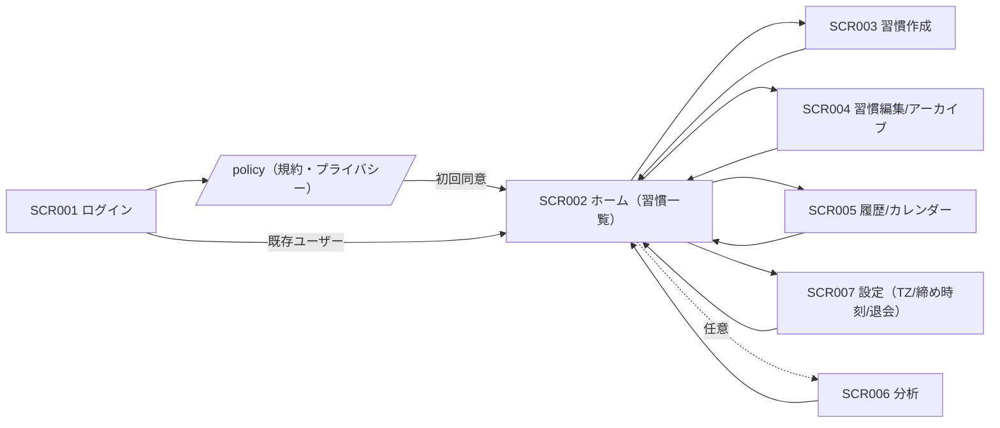
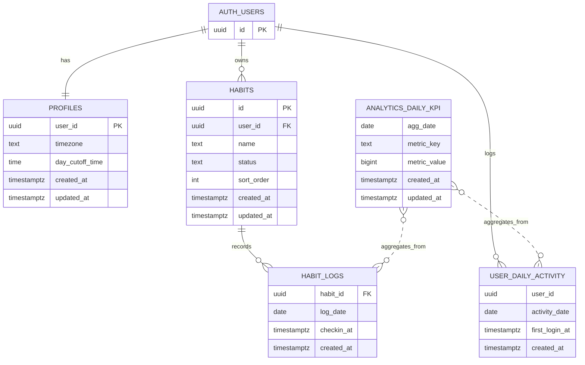

# HabiMake 要件定義書（統合版）

> 個人向け習慣化支援Webアプリ「HabiMake」の要件定義書です。

---

## 表紙

* プロジェクト名：HabiMake（習慣化支援Webアプリ）
* システム名／プロダクト名：HabiMake
* 文書タイトル：要件定義書
* バージョン：0.3.0（レビュー反映統合版）
* 作成日：2026-02-11
* 作成者：aliyell
* レビュー：aliyell
* 承認：aliyell

---

## 改訂履歴（バージョン管理）

| バージョン | 日付         | 変更内容                           | 作成者     | 承認者     |
| ----- | ---------- | ------------------------------ | ------- | ------- |
| 0.1.0 | 2026-02-11 | 初版（ドラフト）作成                     | aliyell | aliyell |
| 0.2.0 | 2026-02-11 | 仕様確定反映（締め時刻/ストリーク/退会/KPI等）＋統合版 | aliyell | aliyell |
| 0.3.0 | 2026-02-11 | KPI目標値・運用方針・Mermaid図・合意欄を反映    | aliyell | aliyell |
| 1.0.0 | 2026-04-01 | 正式版リリース（予定）                    | aliyell | aliyell |

---

## ドキュメント管理・前提

* 保存場所（URL/パス）：GitHub：repo（今後作成）
* 関連ドキュメント：要件バックログ、見積、企画メモ、画面案、テスト計画 等
* 参照規約：開発規約、セキュリティポリシー、UIガイドライン 等
* 変更管理／承認フロー：起票 → レビュー → 承認 → 反映
* バックアップ：週次（ドキュメント自体はGit管理、システムデータは4.5の方針に準拠）

---

## 0. 目次

（エディタやツールで自動生成を推奨）

---

## 1. 概要（背景・目的・用語）

### 1.1 背景

* 現状／課題：

  * 習慣化は「やる気」ではなく、**日々の実行・記録・可視化**を継続できる仕組みが必要です。
  * 継続を阻害する代表要因として「記録が面倒」「成果が見えない」「途切れたら戻りにくい」などが想定されます。
* 影響範囲（業務・顧客・法令等）：

  * 個人向け（B2C）として、生活改善/学習/運動/健康など幅広い習慣を対象とします。
  * 医療行為の代替は行わず、個人情報の適切な取り扱い（プライバシーポリシー等）の整備が必要です。
* 解くべき真因（根本課題）：

  * 「毎日やる行動」を迷わず実行できる導線と、継続の達成感（報酬）が不足している。
  * HabiMakeでは **ストリーク（連続達成）** を主役として、継続の達成感を可視化します。

### 1.2 目的・成功基準（KGI/KPIs）

* 目的：

  * 個人ユーザーが、日々の習慣を「無理なく」継続できるようにし、行動の定着を支援します。

* 成功基準（定量：MVP目標）

  * **7日継続率（Retention_7d）：30%**
  * **30日継続率（Retention_30d）：10%**
  * **週平均チェックイン回数：6回/週**
  * **習慣登録→初回達成率：60%**

* Retentionの定義（本書の前提）

  * **起点（Day0）：初回ログイン日**
  * **「継続」判定：起点日から N 日以内（N=7/30）に1回でもログインがあれば継続**
  * 注：いわゆる Rolling Retention の定義

* 非目的（スコープ外の期待）：

  * 医療行為の代替（診断・治療・服薬指示等）
  * 習慣化の成果の保証
  * 企業向け管理（従業員の監視/査定用途 等）
  * 通知（メール/Push/LINE等）※現時点では対象外

### 1.3 ステークホルダー一覧

| 区分            | 氏名/部署   | 役割         | 決裁権限 | 連絡先                                                         |
| ------------- | ------- | ---------- | ---- | ----------------------------------------------------------- |
| 発注者/プロダクトオーナー | aliyell | 企画/意思決定    | あり   | [ai.engineer.st@gmail.com](mailto:ai.engineer.st@gmail.com) |
| 利用者           | 個人ユーザー  | 利用・フィードバック | なし   | -                                                           |
| 開発            | aliyell | 設計/実装      | 技術判断 | [ai.engineer.st@gmail.com](mailto:ai.engineer.st@gmail.com) |
| 運用/保守         | aliyell | 問い合わせ/障害対応 | 運用判断 | [ai.engineer.st@gmail.com](mailto:ai.engineer.st@gmail.com) |

### 1.4 用語定義（Glossary）

| 用語                    | 定義                                                 |
| --------------------- | -------------------------------------------------- |
| 習慣（Habit）             | ユーザーが継続したい行動（例：英単語10分、筋トレ、日記など）                    |
| 達成（Check-in）          | その日の習慣を実行した記録                                      |
| ストリーク（Streak）         | 連続達成日数。猶予1日（未達成1日まで維持）、2日連続未達成でリセット                |
| 締め時刻（day_cutoff_time） | 「1日」の区切り時刻。例：03:00。ユーザーが任意に設定可能                    |
| Supabase              | 認証/DB/API等を提供するBaaS。今回はGoogleログイン（Auth）とDBに利用      |
| Google Auth           | Googleアカウントでログインする仕組み（Supabase経由）                  |
| RLS                   | Row Level Security（行レベル権限制御）。ユーザー本人のみデータ参照を許可する仕組み |
| DAU                   | 日次アクティブユーザー数。本書では「当日初回ログインしたユニークユーザー数」             |

### 1.5 対象範囲（Where）/ 対象外

* 対象（MVP）：

  * Googleログイン（Supabase Auth）
  * 習慣の作成・編集・アーカイブ（終了）
  * 日次の達成記録（チェックイン）
  * 継続状況の可視化（ストリーク、履歴/カレンダー、簡易統計）
  * ユーザー設定（タイムゾーン、締め時刻、退会）
  * 匿名KPI（DAU/チェックイン等）の保持
  * /policy（利用規約・プライバシーポリシー）ページと初回同意

* 対象外（現時点）：

  * 通知（メール/プッシュ/LINE等）
  * 課金・決済（サブスク/買い切り等）
  * コミュニティ/ランキング等のソーシャル機能

* インターフェース境界：

  * 認証/DBは Supabase を利用（Google OAuth含む）
  * アプリは UI/データ管理/可視化 を担う

### 1.6 システム全体像（構成図）

```mermaid
flowchart TB
  U[ユーザー（スマホ）] --> B[モバイルブラウザ]
  B --> V[Vercel（Next.js / React）]

  V -->|Googleログイン| SA[Supabase Auth]
  V -->|データ操作| SD[Supabase Postgres（RLS有効）]

  SD -->|INSERT/UPDATE など| KPI[匿名KPI更新（DBトリガ or Edge Function）]
  KPI --> AK[analytics_daily_kpi（匿名集計）]

  V -->|当日初回ログイン時| UDA[user_daily_activity（重複排除）]
  UDA --> AK

  subgraph Supabase
    SA
    SD
    UDA
    AK
  end
```

---

## 2. 業務要件

### 2.1 業務フロー

* 基本フロー（個人ユーザー）：

  1. ユーザーは HabiMake にアクセス
  2. 「Googleでログイン」→ **/policy（利用規約・プライバシーポリシー）への同意（初回）** → セッション確立
  3. 習慣を作成（習慣名、並び順 等）
  4. 毎日、習慣を実行したらチェックイン
  5. ストリーク/履歴画面で継続状況を確認
  6. 不要になった習慣はアーカイブ（終了）
  7. 必要に応じて締め時刻を調整
  8. 退会（即時削除）

* 例外・例外処理：

  * ログイン失敗（Google/Supabase）：再試行、エラーメッセージ表示
  * 日付判定の誤認防止：TZ＋締め時刻により対象日（log_date）を算出
  * 二重チェックイン：同一日2回目以降は無効（1回目のみ有効）

### 2.2 規模（スケール）

| 指標             | 想定値         | 備考                 |
| -------------- | ----------- | ------------------ |
| 月間処理件数（チェックイン） | 約6,000件/月   | MAU100 × 習慣3 × 20日 |
| 同時ログイン数        | 5〜10        | ピーク時間帯（朝/夜）を想定     |
| 対象データ件数（ログ）    | 約109,500件/年 | 100 × 3習慣 × 365日   |
| 稼働時間帯          | 24時間        | 個人向け               |

### 2.3 時期・時間（スケジュール）

* ピーク時間帯：朝（6-9時）/ 夜（21-24時）
* 締切／締め時間：

  * 1日の判定境界：ユーザー設定の締め時刻（初期 03:00）
* バッチ頻度/タイミング：

  * KPIのうち Retention（7d/30d）は日次で再計算（確定値を保存）
  * その他（dau/checkins等）はイベント都度で更新（リアルタイム）

### 2.4 評価指標（KPI）

| 指標              | 定義                                     | 目標値      | 集計方法                                           |
| --------------- | -------------------------------------- | -------- | ---------------------------------------------- |
| DAU             | 当日初回ログインしたユニークユーザー数（同日2回目以降は除外）        | **20**   | user_daily_activity を重複排除し日次集計                 |
| チェックイン数         | 当日のチェックイン登録数                           | **20/日** | habit_logs insert を起点に analytics_daily_kpi を加算 |
| 7日継続率（Rolling）  | 初回ログイン日（Day0）を起点に、7日以内に1回でもログインがあれば継続  | **30%**  | コホート集計（匿名化して保持）                                |
| 30日継続率（Rolling） | 初回ログイン日（Day0）を起点に、30日以内に1回でもログインがあれば継続 | **10%**  | コホート集計（匿名化して保持）                                |
| 週平均チェックイン回数     | 1ユーザーあたりの週次チェックイン回数平均                  | **6回/週** | habit_logs を週次集計（匿名集計に変換して保持）                  |
| 習慣登録→初回達成率      | 習慣作成後、初回チェックインに到達した割合                  | **60%**  | habits と habit_logs の到達率を集計（匿名集計）              |

### 2.5 業務ルール

* 習慣の頻度：毎日固定（MVP）

* 日付判定（タイムゾーン／日付境界）：

  * タイムゾーン：ユーザー設定（初期値：Asia/Tokyo）
  * 日付境界：ユーザーが締め時刻を設定（初期 03:00、設定範囲は任意）
  * 変更時の扱い：変更以降のみ適用（過去ログは再計算しない）

* チェックイン：

  * 同一日に複数回チェックイン：1回目のみ有効
  * 取り消し：当日分のみ取り消し可能

* ストリーク計算：

  * 未達成1日までは維持（猶予1日／自動消費）
  * 2日連続未達成でリセット（0）
  * 表示：猶予中もストリーク数字は維持し「猶予1日」を表示
  * 最長ストリーク：保持

* 習慣の終了：

  * アーカイブ（status=archived）とし、過去ログは保持
  * ホームには active のみ表示

* 退会（データ削除）：

  * 即時削除：profiles/habits/habit_logs/user_daily_activity 等の個人データを削除
  * 匿名KPI（analytics_daily_kpi 等）は個人識別子を含めない形で保持（全KPI保持方針）
  * バックアップに含まれる残存分はバックアップ保持期間（最大7日）経過で消滅

---

## 3. 機能要件

### 3.1 機能ブレイクダウン（一覧）

| 大分類  | 中分類    | 小分類        | 説明                        | 優先度(MoSCoW) |
| ---- | ------ | ---------- | ------------------------- | ----------- |
| 認証   | ログイン   | Googleログイン | Supabase Google Authでログイン | M           |
| 認証   | ポリシー同意 | 初回同意       | /policyへの同意（初回）           | M           |
| 認証   | セッション  | ログアウト      | ログアウト/セッション切れ対応           | M           |
| 習慣管理 | 習慣CRUD | 新規作成       | 習慣名を登録                    | M           |
| 習慣管理 | 習慣CRUD | 編集         | 習慣名/並び順等を変更               | M           |
| 習慣管理 | 終了     | アーカイブ      | status=archived に変更（ログ保持） | M           |
| 記録   | チェックイン | 達成記録       | 当日の達成を記録（1回目のみ有効）         | M           |
| 記録   | チェックイン | 取り消し       | 当日分のみ取り消し                 | S           |
| 可視化  | ストリーク  | 連続日数表示     | 猶予/リセット含めて表示              | M           |
| 可視化  | 履歴     | カレンダー/一覧   | 達成履歴表示（習慣別切替）             | S           |
| 設定   | ユーザー設定 | タイムゾーン     | 日付判定の基準を設定                | S           |
| 設定   | ユーザー設定 | 締め時刻       | 1日の区切り時刻を設定（初期03:00）      | S           |
| 設定   | アカウント  | 退会         | 即時削除（個人データ削除）             | S           |
| 分析   | KPI    | リアルタイム集計   | dau/checkins等をイベント都度で更新   | S           |
| 通知   | リマインド  | 通知         | 対象外                       | W           |

### 3.2 利用シナリオ / ユーザーストーリー

1. ユーザーはGoogleでログインし、初回に/policyへ同意できる
2. ユーザーは最初の習慣を1つ作成できる
3. ユーザーはその日の習慣を達成したらチェックインし、ストリーク更新を確認できる
4. ユーザーは猶予中（未達成1日）でもストリークが維持されることを理解できる
5. ユーザーは過去の達成履歴（カレンダー/一覧）を見て振り返れる
6. ユーザーは不要になった習慣をアーカイブでき、履歴は保持される
7. ユーザーは締め時刻を変更しても「変更以降のみ」適用されることを理解できる
8. ユーザーは退会で個人データが削除されることを確認できる

### 3.3 画面要件（画面一覧と遷移）

| 画面ID   | 画面名       | 目的・役割           | 主な要素                                     | 関連機能       |
| ------ | --------- | --------------- | ---------------------------------------- | ---------- |
| SCR001 | ログイン      | Googleログイン導線    | Googleログイン、/policyへのリンク、同意チェック（初回）、エラー表示 | Googleログイン |
| SCR002 | 習慣一覧（ホーム） | 今日の習慣確認＋即チェックイン | 習慣カード、ストリーク、猶予表示、達成ボタン、設定導線              | 表示/チェックイン  |
| SCR003 | 習慣作成      | 新規習慣登録          | 習慣名入力、並び順（任意）、バリデーション                    | 習慣作成       |
| SCR004 | 習慣編集      | 既存習慣の編集/アーカイブ   | 編集フォーム、アーカイブボタン                          | 習慣編集/終了    |
| SCR005 | 履歴/カレンダー  | 達成履歴の確認         | カレンダー、習慣フィルタ、archived表示切替（任意）            | 履歴表示       |
| SCR006 | 分析（任意）    | 簡易統計の表示         | 達成率、最長記録等（任意）                            | 指標表示       |
| SCR007 | 設定        | TZ/締め時刻/退会      | タイムゾーン、締め時刻、退会、ログアウト                     | 設定         |
| SCR008 | /policy   | 利用規約/プライバシー表示   | 利用規約、プライバシーポリシー、同意UI（初回）                 | 初回同意       |

#### 画面遷移図（Mermaid）

#### SCR002 習慣一覧（ホーム）詳細（スマホ最適）

* 目的：今日のチェックインを即完了し、ストリーク状況（猶予含む）をひと目で把握する
* UX目標：ホーム表示 → チェックイン完了まで 2タップ以内
* 習慣カード要素：

  * 習慣名 / ストリーク（例：🔥12日）/ 状態バッジ / 「達成」ボタン
* 状態定義：

  * 達成済み：✅達成済み（ボタン無効）
  * 未達成：達成ボタン有効
  * 猶予中：ストリーク数字は維持＋バッジ「猶予1日」
  * リセット：ストリーク0（必要ならバッジ「リセット」）

### 3.4 情報・データ・ログ

#### ER図（Mermaid）

> 補足：MermaidのERは外部（auth.users）を `AUTH_USERS` として簡略表現しています。実DBではSupabase Authを正とします。

#### テーブル案（Supabase PostgreSQL）

##### profiles（ユーザー設定）

| カラム             | 型（例）        | 必須  | 説明                    |
| --------------- | ----------- | --- | --------------------- |
| user_id         | uuid        | Yes | auth.users.id と同一（PK） |
| timezone        | text        | Yes | 例：Asia/Tokyo（初期）      |
| day_cutoff_time | time        | Yes | 締め時刻（初期03:00、任意範囲）    |
| created_at      | timestamptz | Yes | 作成日時                  |
| updated_at      | timestamptz | Yes | 更新日時                  |

##### habits（習慣マスタ）

| カラム        | 型（例）        | 必須  | 説明                |
| ---------- | ----------- | --- | ----------------- |
| id         | uuid        | Yes | PK                |
| user_id    | uuid        | Yes | 所有者               |
| name       | text        | Yes | 習慣名               |
| status     | text        | Yes | active / archived |
| sort_order | int         | No  | 並び順（任意）           |
| created_at | timestamptz | Yes | 作成日時              |
| updated_at | timestamptz | Yes | 更新日時              |

##### habit_logs（達成ログ：日次）

| カラム        | 型（例）        | 必須  | 説明              |
| ---------- | ----------- | --- | --------------- |
| habit_id   | uuid        | Yes | FK（habits.id）   |
| log_date   | date        | Yes | 対象日（TZ+締め時刻で算出） |
| checkin_at | timestamptz | Yes | 実チェックイン時刻       |
| created_at | timestamptz | Yes | 作成日時            |

* 制約：

  * 一意制約：(habit_id, log_date)
  * インデックス：habits(user_id)、habit_logs(habit_id, log_date)

##### user_daily_activity（DAU重複排除：個人データ）

| カラム            | 型（例）        | 必須  | 説明            |
| -------------- | ----------- | --- | ------------- |
| user_id        | uuid        | Yes | auth.users.id |
| activity_date  | date        | Yes | KPI基準日（集計日）   |
| first_login_at | timestamptz | Yes | 当日初回ログイン時刻    |
| created_at     | timestamptz | Yes | 作成日時          |

* 制約：

  * 一意制約：(user_id, activity_date)

##### analytics_daily_kpi（匿名KPI：全体集計）

| カラム          | 型（例）        | 必須  | 説明                                                               |
| ------------ | ----------- | --- | ---------------------------------------------------------------- |
| agg_date     | date        | Yes | 集計日                                                              |
| metric_key   | text        | Yes | dau / checkins / habits_created / retention_7d / retention_30d 等 |
| metric_value | bigint      | Yes | 値                                                                |
| created_at   | timestamptz | Yes | 作成日時                                                             |
| updated_at   | timestamptz | Yes | 更新日時                                                             |

* 制約：

  * 一意制約：(agg_date, metric_key)

#### ストリーク計算方針

* 仕様：猶予1日／2日連続未達成でリセット
* MVPは、ホーム表示時に直近の habit_logs を参照して計算

#### KPI集計方式（リアルタイム＋一部日次確定）

* DAU（当日初回ログイン）：

  * ログイン成功（セッション確立）時に user_daily_activity を insert（重複時は何もしない）
  * 新規insertできた場合のみ analytics_daily_kpi(dau) を +1
* チェックイン数：

  * habit_logs insert のタイミングで analytics_daily_kpi(checkins) を +1
* Retention（7d/30d）：

  * Rolling Retentionの確定値は日次再計算で analytics_daily_kpi に保存

#### ログ設計（推奨：MVP）

* 種別：

  * アプリケーションログ（画面/APIのエラー、主要イベント）
  * セキュリティ/監査ログ（認証失敗、RLSエラー、権限エラーなど）
  * インフラ/基盤ログ（Vercel / Supabase の提供ログ）

* 個人情報の扱い：

  * ログに「習慣名」などの内容は原則出さない
  * user_idは必要最小限（可能ならハッシュ化/マスキング）
  * メールアドレス等の直接識別子はログに出さない

* 保持期間（推奨：MVP）：

  * アプリケーションログ：30日
  * セキュリティ/監査ログ：90日
  * 匿名KPI（analytics_daily_kpi）：保持（個人識別子なし）

#### RLS（Row Level Security）方針

* profiles：auth.uid() = user_id のみ参照/更新
* habits：auth.uid() = user_id のみCRUD
* habit_logs：対象habitが自分の所有物であることを条件に参照/追加/削除
* user_daily_activity：クライアントから参照不可（サーバ側のみで利用）
* analytics_daily_kpi：読み取りは公開可（任意）、書き込みはサーバ側のみ

### 3.5 外部インターフェース

| IF名   | 接続先             | 目的                 | 方式              | 認証                  | フォーマット | 再送/エラー            |
| ----- | --------------- | ------------------ | --------------- | ------------------- | ------ | ----------------- |
| 認証IF  | Supabase Auth   | Googleログイン/セッション管理 | REST/HTTPS（SDK） | OAuth2/OIDC（Google） | JSON   | リトライ最大3回（指数バックオフ） |
| データIF | Supabase DB/API | 習慣/ログ/設定の保存・参照     | REST/HTTPS（SDK） | JWT（Supabaseセッション）  | JSON   | リトライ最大3回（指数バックオフ） |

* タイムアウト（推奨）：10秒
* エラー時：ユーザーへ簡易メッセージ表示＋再試行導線

### 3.6 トレーサビリティ

| 背景/課題         | 要件ID    | 機能/非機能             | テストケースID |
| ------------- | ------- | ------------------ | -------- |
| 継続の達成感が続かない   | REQ-001 | ストリーク表示（猶予/リセット含む） | TC-001   |
| 記録が面倒で続かない    | REQ-002 | ホームで即チェックイン（2タップ）  | TC-002   |
| 日付感覚が人により異なる  | REQ-003 | 締め時刻設定（未来のみ適用）     | TC-003   |
| 二重カウントで指標がブレる | REQ-004 | DAU重複排除（当日初回ログイン）  | TC-004   |
| 個人情報の越境参照     | REQ-005 | RLSによる行レベル制御       | TC-005   |

---

## 4. 非機能要件

### 4.1 ユーザビリティ/アクセシビリティ

* UI方針：スマホ優先（モバイルファースト）
* 目標：今日のチェックインがトップから2タップ以内
* アクセシビリティ：コントラスト、タップ領域（44px目安）、フォーカス表示を配慮
* 検証：Lighthouse＋簡易ユーザーテスト（3〜5名）

### 4.2 システム方式（アーキテクチャ）

* 形態：Webアプリ（レスポンシブ、スマホ中心）
* 採用技術：

  * フロント：Next.js（React）
  * 認証/DB：Supabase（Auth + PostgreSQL）
  * ホスティング：Vercel

### 4.3 規模（スケーラビリティ）

| 項目         | 想定値           | 設計方針            |
| ---------- | ------------- | --------------- |
| 同時接続ユーザー   | 5〜10          | クエリ最適化（必要最小取得）  |
| 1日トランザクション | 300（チェックイン想定） | MAU100×習慣3を想定   |
| 保持データ件数    | 約10万件/年       | インデックス設計＋保持期間方針 |

### 4.4 性能（パフォーマンス）

* 応答時間：主要画面（ホーム/履歴）は3秒以内
* ストリーク判定：表示時に計算（MVP）
* 負荷試験：MVPは簡易（Lighthouse＋軽い並列アクセス）

### 4.5 信頼性（可用性/バックアップ）

* 稼働率（SLA目標）：99.5%/月（MVP推奨）
* バックアップ（推奨方針）：

  * DB（Supabase Postgres）：日次バックアップ（スナップショット）、保持7日
  * アプリ（Vercel）：デプロイ履歴により即時ロールバック
* 目標復旧指標（RPO/RTO：MVP推奨）：

  * RPO：24時間
  * RTO：24時間
* 退会即時削除とバックアップ：

  * 本番DB上の個人データは即時削除
  * バックアップ残存は保持期間（最大7日）で自然消滅（ポリシー明記）

### 4.6 拡張性

* 将来拡張候補：通知、頻度拡張（週N/曜日指定）、PWA、分析強化
* 方針：スキーマ移行（migrations）と段階リリース（Feature Toggle）を検討

### 4.7 互換性（前方/後方）

* スキーマ変更はマイグレーション手順とロールバックを用意
* 破壊的変更は段階移行で実施

### 4.8 継続性（DR/BCP）

* MVPはクラウド提供範囲に依存
* 障害時：Vercel/Supabaseステータス確認 → 影響範囲特定 → 復旧対応

---

## 5. セキュリティー要件

### 5.1 情報分類・アクセス制御

* 機密：ユーザー設定（締め時刻/タイムゾーン）、習慣データ、達成ログ、user_daily_activity
* アクセス制御：RLSでユーザー本人のみ参照可能
* 運用者閲覧：原則なし（必要時のみbreak-glassを別途定義）

### 5.2 認証/認可

* 認証：Supabase Google Auth（OIDC/OAuth2）
* ログイン成功判定点：**セッション確立後**（当日初回ログインのみDAU加算）
* トークン更新（リフレッシュ）はDAUに含めない
* 認可：画面/APIともに認証必須（ログイン前はSCR001と/policyのみ）

### 5.3 暗号化

* 通信：TLS（HTTPS）
* 保管：Supabase/Vercelの標準暗号化に準拠

### 5.4 攻撃対策・安全な実装

* 入力検証、XSS対策（サニタイズ/エスケープ）、CSRF（Cookie運用時）対策
* レート制限：MVPは基盤機能＋簡易制限（必要ならEdge/Vercel側で強化）
* 依存ライブラリ脆弱性管理：自動スキャン＋月次アップデート
* キー管理：

  * anon key：公開前提（クライアント配置可）
  * service role key：クライアント配置禁止（サーバ側のみ）

### 5.5 稼働環境（対応プラットフォーム）

* 対応ブラウザ：iOS Safari / Android Chrome（現行+1）
* ホスティング：Vercel

  * Preview環境は本番DBに接続しない（dev用Supabaseを推奨）

### 5.6 セキュリティテスト/監査

* リリース前：

  * RLSテスト（他ユーザー参照不可）を必須化
  * 主要フローのセキュリティ観点チェック（認証/認可/入力検証/XSS）
  * 依存ライブラリ脆弱性スキャン
* 合否基準：重大脆弱性0、RLS違反0
* 証跡：診断結果・設定変更履歴・主要エラーログ（保持：アプリ30日、監査90日）

---

## 6. 移行要件

### 6.1 対象/戦略

* 対象：アプリ（Next.js）、Supabase（Auth/DB/RLS）、Vercel環境変数
* 戦略：新規構築のためデータ移行は原則なし。MVPを一括リリース（必要なら段階公開）

### 6.2 スケジュール/タイミング

* リリース希望日：2026-04-01
* 予備日：2026-05-01
* 告知計画：しない（MVP）

### 6.3 リスク管理とバックアップ

* 事前バックアップ：Supabase DBのバックアップ/スナップショットを取得
* ロールバック：Vercel直前デプロイへ戻す／DBは復元またはマイグレーションのdown手順

### 6.4 手順（サンプル）

1. Supabaseプロジェクト作成（dev/prod）
2. Google OAuth設定（本番ドメイン、リダイレクトURI）
3. DBマイグレーション適用（profiles/habits/habit_logs/user_daily_activity/analytics）
4. RLS/ポリシー適用・テスト
5. Vercelデプロイ（環境変数設定）
6. スモークテスト（ログイン→同意→習慣作成→チェックイン→履歴→締め時刻跨ぎ→退会）
7. 公開

### 6.5 体制/責任分界

* 実施者：aliyell
* レビュー：aliyell
* 承認：aliyell

### 6.6 検証（バリデーション）

* 締め時刻03:00跨ぎの log_date 算出が正しい
* 2日連続未達成でストリークがリセットされる
* RLSにより他ユーザーのデータ参照不可
* 退会で個人データが削除される（匿名KPIは残る）

---

## 7. 運用要件

### 7.1 教育（トレーニング）

* 対象：個人ユーザー
* 形式：アプリ内ヘルプ（簡易チュートリアル）、FAQ
* 成果物：使い方（ログイン/同意/習慣作成/チェックイン/締め時刻/退会）

### 7.2 運用（日常業務と体制）

* 体制：オンコールなし（MVP）／障害時は開発者対応
* 定常：エラーログ確認（週次）、依存ライブラリ更新（月次）
* 非定常：

  * 障害対応（Vercel/Supabaseステータス確認 → 切り分け）
  * 問い合わせ対応（窓口）：[ai.engineer.st@gmail.com](mailto:ai.engineer.st@gmail.com)

### 7.3 保守

* 範囲：アプリ、DBスキーマ、RLS、認証設定
* 優先度（SLA運用目安）：

  * P1（ログイン不能/データ参照不能）：初動4h以内、暫定復旧24h以内
  * P2（主要機能の一部不具合）：初動1営業日以内

### 7.4 監視/アラート

* 監視対象：

  * Vercel：5xx増加、ビルド/デプロイ失敗、レスポンス遅延
  * Supabase：Auth失敗率、DBエラー、RLS関連エラー
* アラート条件：

  * P1：ログイン不能、主要画面が継続的に5xx、DB接続不可
  * P2：一部機能不具合、エラー率上昇、性能劣化
* 通知先（MVP）：メール（[ai.engineer.st@gmail.com](mailto:ai.engineer.st@gmail.com)）

### 7.5 定期メンテナンス

* 月次：依存ライブラリ更新、脆弱性対応、Supabase設定差分確認

### 7.6 ドキュメント/ナレッジ

* 変更履歴：改訂履歴に反映
* 運用Runbook：障害時チェックリスト、ロールバック、連絡先

---

## 8. 制約・前提条件

* 契約・ライセンス制約：Supabase / Vercel / Google OAuth の利用規約に従う
* 法令/ガイドライン準拠：プライバシーポリシー整備（退会即時削除、匿名KPI保持、バックアップ保持の説明）
* 技術前提：Next.js（React）＋Supabase＋Vercel
* 告知：行わない（MVP）

---

## 9. リスク・課題一覧

| ID   | リスク/課題                             | 影響 | 発生確率 | 対応方針                                                | 担当      |
| ---- | ---------------------------------- | -- | ---- | --------------------------------------------------- | ------- |
| R-01 | 締め時刻（任意）により log_date 算出が複雑化        | 高  | 中    | 跨ぎ/変更以降のみ適用のテストケースを用意、単体テスト必須                       | aliyell |
| R-02 | RLS設定ミスで他ユーザーのデータが参照可能になる          | 極高 | 低〜中  | RLSテスト必須、レビュー、最小権限                                  | aliyell |
| R-03 | 退会即時削除が不完全（バックアップ扱い含む）             | 高  | 中    | 削除対象/対象外を明文化、バックアップ保持（7日）をポリシー明記                    | aliyell |
| R-04 | 匿名KPIが再識別リスクを持つ（粒度が細かすぎる等）         | 高  | 低〜中  | 全体日次など十分な集約粒度に限定、小集団集計はしない                          | aliyell |
| R-05 | リアルタイムKPI更新がDB競合/負荷を増やす            | 中  | 中    | upsert最適化、メトリクス最小化、必要なら日次へ移行                        | aliyell |
| R-06 | DAU重複排除が不完全で指標が信用されない              | 中  | 中    | DAUを「当日初回ログイン」に固定し (user_id, activity_date) 一意制約で担保 | aliyell |
| R-07 | Google OAuth設定不備（リダイレクトURI/本番ドメイン） | 中  | 中    | dev/prod分離、設定チェックリスト化                               | aliyell |
| R-08 | Supabase/Vercel障害に依存（ベンダーロック含む）    | 中  | 低    | ステータス監視、将来の移行方針を検討                                  | aliyell |
| R-09 | 猶予表示がユーザーに誤解される                    | 中  | 中    | UI文言とヘルプで説明、「猶予1日」を明確化                              | aliyell |
| R-10 | モバイルUIが煩雑で継続率が上がらない                | 中  | 中    | 2タップ完了のUX維持、簡易ユーザーテスト                               | aliyell |

---

## 10. 付録

* 参照資料：

  * 画面遷移図：本書内にMermaidで記載（3.3）
  * ER図：本書内にMermaidで記載（3.4）
  * 利用規約／プライバシーポリシー：/policy（開発中に追加予定）

---

## 合意欄（サインオフ）

| 役割      | 氏名      | 日付         | 署名   |
| ------- | ------- | ---------- | ---- |
| 発注者（決裁） | aliyell | 2026-02-11 | （省略） |
| 事業責任者   | aliyell | 2026-02-11 | （省略） |
| 開発責任者   | aliyell | 2026-02-11 | （省略） |
| 運用責任者   | aliyell | 2026-02-11 | （省略） |

> 署名時点のバージョン： v1.0.0
